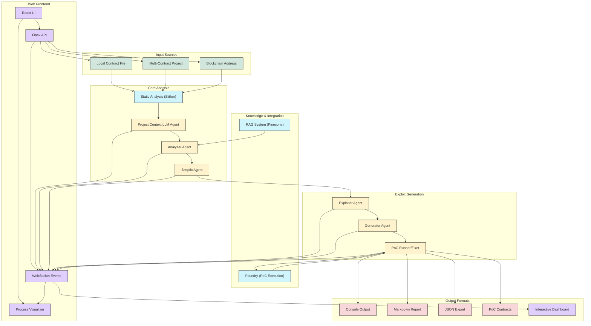

# AuditAgent System Handover Document

## Table of Contents

1. [System Overview](#system-overview)
2. [Architecture and Components](#architecture-and-components)
3. [Setup and Installation](#setup-and-installation)
4. [Configuration Options](#configuration-options)
5. [Running Analyses](#running-analyses)
6. [Web Frontend](#web-frontend)
7. [Benchmarking and Evaluation](#benchmarking-and-evaluation)
8. [Understanding Results](#understanding-results)
9. [Troubleshooting](#troubleshooting)

## System Overview

AuditAgent is an advanced smart contract auditing system that leverages Large Language Models (LLMs) in a multi-agent workflow to automatically:
- Analyze smart contracts for security vulnerabilities
- Identify potential exploits with confidence scoring
- Generate proof-of-concept (PoC) exploit code
- Automatically execute and verify exploits

The system combines static analysis tools (Slither) with a pipeline of specialized LLM agents, each responsible for a specific task in the vulnerability detection and exploit generation process.

### Key Features

- **Multi-Agent LLM Workflow**: Specialized agents collaborate for detection, validation, and exploit generation
- **Static Analysis Integration**: Leverages Slither for initial code understanding
- **RAG Enhancement**: Optional Retrieval-Augmented Generation improves detection by leveraging a knowledge base of vulnerabilities
- **Multi-Contract Project Analysis**: Analyzes interactions between contracts in complex projects
- **Blockchain Integration**: Can fetch and analyze contracts directly from Ethereum, BSC, Base, and Arbitrum
- **Automatic PoC Generation**: Creates Foundry test files demonstrating exploits
- **Self-Correcting Execution**: Automatically runs and fixes generated exploit code
- **Flexible LLM Configuration**: Supports various models (OpenAI, Anthropic, etc.) with per-agent configuration
- **Comprehensive Benchmarking**: Tools to evaluate vulnerability detection and exploit generation performance
- **Web-Based User Interface**: Interactive frontend for visualization of analysis process and results

## Architecture and Components

The AuditAgent system uses a pipeline architecture with the following key components:



### Agent Pipeline

1. **Static Analysis**: Parse contract with Slither to extract function details, call graph, detector results
2. **Project Context Agent**: Analyze inter-contract relationships in multi-file projects
3. **Analyzer Agent**: Identify potential vulnerabilities using static analysis results and (optionally) RAG
4. **Skeptic Agent**: Re-evaluate findings to reduce false positives
5. **Exploiter Agent**: Design step-by-step exploit plans for high-confidence vulnerabilities
6. **Generator Agent**: Create executable Foundry-based PoC code
7. **Exploit Runner**: Execute and attempt to fix failing PoCs

## Setup and Installation

### Prerequisites

- Python 3.8+ with pip
- Git
- Solidity Compiler (`solc-select`)
- Slither
- Foundry (for PoC execution)
- API keys for at least one LLM provider (OpenAI, Anthropic, etc.)
- (Optional) Blockchain explorer API keys (Etherscan, BscScan, etc.)
- (Optional) Pinecone account for RAG functionality

### Installation Steps

1. **Clone Repository**:
   ```bash
   git clone https://github.com/your-username/fyp-fr.git
   cd fyp-fr
   ```

2. **Initialize Foundry**:
   ```bash
   cd exploit
   forge init --no-git
   git submodule update --init --recursive
   cd ..
   ```

3. **Create Python Environment**:
   ```bash
   python3 -m venv .venv
   source .venv/bin/activate  # On Windows: .venv\Scripts\activate
   ```

4. **Install Dependencies**:
   ```bash
   pip install -r requirements.txt
   ```

5. **Configure Environment Variables**:
   Create a `.env` file in the project root with your API keys:
   ```
   OPENAI_API_KEY="sk-YourOpenAIKeyHere"
   # ANTHROPIC_API_KEY="YourAnthropicKeyHere"
   # DEEPSEEK_API_KEY="YourDeepSeekKeyHere"

   # Optional: Blockchain explorer keys
   # ETHERSCAN_API_KEY="YourEtherscanKeyHere"
   # BSCSCAN_API_KEY="YourBscScanKeyHere"
   # BASESCAN_API_KEY="YourBaseScanKeyHere"
   # ARBISCAN_API_KEY="YourArbiScanKeyHere"

   # Optional: Pinecone (for RAG functionality)
   # PINECONE_API_KEY="YourPineconeKeyHere"
   # PINECONE_ENV="YourPineconeEnvironmentHere"  # e.g., us-west1-gcp
   ```

6. **Install Solidity Compiler**:
   ```bash
   pip install solc-select
   solc-select install 0.8.0  # Or the version needed
   solc-select use 0.8.0  # Set as default
   ```

7. **Verify Installation**:
   ```bash
   python --version
   pip --version
   slither --version
   forge --version
   solc --version
   ```

## Configuration Options

AuditAgent offers extensive configuration options through command-line arguments to `main.py`.

### Model Configuration

You can specify different LLM models for each agent in the pipeline:

```bash
python main.py \
  --analyzer-model claude-3-7-sonnet-latest \
  --skeptic-model o3-mini \
  --exploiter-model o3-mini \
  --generator-model o3-mini \
  --context-model o3-mini \
  --contract examples/VulnerableLendingContract.sol
```

Or use the same model for all agents:

```bash
python main.py --all-models o3-mini --contract examples/VulnerableLendingContract.sol
```

### Input Options

AuditAgent supports three main input methods:

1. **Local File**:
   ```bash
   python main.py --contract path/to/Contract.sol
   ```

2. **Project Directory** (multi-file analysis):
   ```bash
   python main.py --contract path/to/project_directory/
   ```

3. **Blockchain Contract**:
   ```bash
   python main.py --contract-address 0xContractAddress --network ethereum
   # Networks: ethereum, bsc, base, arbitrum

   # Save separate files for multi-file contracts (helps with project analysis)
   python main.py --contract-address 0xContractAddress --network ethereum --save-separate
   ```

### RAG Configuration

RAG uses Pinecone to enhance vulnerability detection with known patterns:

```bash
# Enable RAG (default)
python main.py --contract examples/VulnerableLendingContract.sol

# Disable RAG
python main.py --no-rag --contract examples/VulnerableLendingContract.sol
```

### PoC Generation and Execution

Control the automatic generation and execution of exploit code:

```bash
# Analyze without generating PoCs
python main.py --skip-poc --contract examples/VulnerableLendingContract.sol

# Generate PoCs but don't run them
python main.py --no-auto-run --contract examples/VulnerableLendingContract.sol

# Configure maximum retry attempts for fixing failing PoCs
python main.py --max-retries 5 --contract examples/VulnerableLendingContract.sol
```

### Output Options

Configure how results are exported:

```bash
# Export Markdown report
python main.py --export-md --contract examples/VulnerableLendingContract.sol

# Export JSON results
python main.py --export-json results.json --contract examples/VulnerableLendingContract.sol
```

### Complete Configuration Reference

| Flag                    | Argument Type          | Default                               | Description                                                               |
| :---------------------- | :--------------------- | :------------------------------------ | :------------------------------------------------------------------------ |
| `--contract`            | `path`                 | `examples/VulnerableLendingContract.sol` | Path to Solidity file or directory to analyze                           |
| `--contract-address`    | `string`               | None                                  | Fetch contract from blockchain address                                    |
| `--network`             | `string`               | `ethereum`                            | Blockchain network (`ethereum`, `bsc`, `base`, `arbitrum`)                |
| `--save-separate`       | (flag)                 | False                                 | Save individual contract files when fetching                              |
| `--analyzer-model`      | `string`               | `o3-mini`                             | LLM model for Analyzer Agent                                              |
| `--skeptic-model`       | `string`               | `o3-mini`                             | LLM model for Skeptic Agent                                               |
| `--exploiter-model`     | `string`               | `o3-mini`                             | LLM model for Exploiter Agent                                             |
| `--generator-model`     | `string`               | `o3-mini`                             | LLM model for Generator Agent                                             |
| `--context-model`       | `string`               | `o3-mini`                             | LLM model for Project Context Agent                                       |
| `--all-models`          | `string`               | None                                  | Use same model for all agents                                             |
| `--api-base`            | `url`                  | None                                  | Custom base URL for LLM API                                               |
| `--no-rag`              | (flag)                 | False                                 | Disable Retrieval-Augmented Generation                                    |
| `--skip-poc`            | (flag)                 | False                                 | Skip PoC generation                                                       |
| `--no-auto-run`         | (flag)                 | False                                 | Don't automatically execute PoCs                                          |
| `--max-retries`         | `integer`              | `3`                                   | Maximum fix attempts for failing PoCs                                     |
| `--export-md`           | (flag)                 | False                                 | Generate Markdown report                                                  |
| `--export-json`         | `path`                 | None                                  | Export results to JSON file                                               |

## Running Analyses

### Basic Analysis

To run a basic analysis on a contract:

```bash
python main.py --contract examples/VulnerableLendingContract.sol
```

This will:
1. Run static analysis with Slither
2. Analyze the contract with all agents
3. Generate and execute PoCs for high-confidence vulnerabilities
4. Display results in the console

### Multi-File Project Analysis

For analyzing multi-contract projects:

```bash
python main.py --contract examples/MultiContract/
```

This additionally:
1. Uses the Project Context Agent to analyze inter-contract relationships
2. Provides insights on cross-contract vulnerabilities

### Optimizing for Different Scenarios

**Quick Analysis (No PoC Generation)**:
```bash
python main.py --skip-poc --no-rag --contract examples/VulnerableLendingContract.sol
```

**Thorough Analysis with High-Quality LLMs**:
```bash
python main.py \
  --analyzer-model claude-3-7-sonnet-latest \
  --skeptic-model claude-3-7-sonnet-latest \
  --generator-model claude-3-7-sonnet-latest \
  --contract examples/VulnerableLendingContract.sol
```

**Analysis with Detailed Reports**:
```bash
python main.py --export-md --export-json results.json --contract examples/VulnerableLendingContract.sol
```

## Web Frontend

AuditAgent includes a web-based frontend interface that provides a user-friendly way to interact with the system, visualize the analysis process, and explore results.

### Setup and Installation

To set up the web frontend:

1. **Navigate to the frontend directory**:
   ```bash
   cd frontend_poc
   ```

2. **Install backend dependencies**:
   ```bash
   pip install flask flask-socketio flask-cors
   ```

3. **Start the backend server**:
   ```bash
   python app.py
   ```

4. **Install frontend dependencies** (in a separate terminal):
   ```bash
   cd frontend_poc/client
   npm install
   ```

5. **Start the development server**:
   ```bash
   npm start
   ```
   
   Or use the pre-built version:
   ```bash
   # The backend will serve the pre-built frontend from the client/build directory
   # Just run app.py and navigate to http://localhost:5000
   ```

### Key Features

The web frontend provides several advantages over the command-line interface:

1. **Interactive Contract Input**:
   - Upload local Solidity files through drag-and-drop
   - Fetch contracts directly from blockchain by address
   - Support for multi-file project uploads

2. **Customizable Analysis Configuration**:
   - Select different LLM models for each agent
   - Toggle RAG functionality
   - Configure PoC generation and execution settings

3. **Real-Time Process Visualization**:
   - Live agent activity indicators
   - Step-by-step workflow visualization
   - Progress tracking for each analysis stage

4. **Enhanced Results Exploration**:
   - Interactive vulnerability cards with expandable details
   - Syntax-highlighted code with vulnerability locations
   - Collapsible exploit plans and PoC code
   - Execution status indicators for generated exploits

5. **Project Context Insights** (for multi-contract projects):
   - Contract relationship visualization
   - Cross-contract vulnerability highlighting
   - Statistics and recommendations for complex projects

### Architecture

The frontend system consists of:

```
frontend_poc/
├── app.py                 # Flask backend server
└── client/                # React frontend application
    ├── src/
    │   ├── components/    # UI components
    │   ├── services/      # API and WebSocket services
    │   ├── pages/         # Main application pages
    │   ├── context/       # React context providers
    │   └── visualizer/    # Agent workflow visualization
    └── build/             # Pre-built frontend files
```

The architecture follows a client-server model:

1. **Backend** (Flask + Flask-SocketIO):
   - Interfaces with the core AuditAgent system
   - Provides RESTful API endpoints
   - Implements real-time communication with WebSockets
   - Manages analysis jobs and their states

2. **Frontend** (React):
   - Responsive user interface built with React and Tailwind CSS
   - Real-time updates using Socket.io client
   - Interactive visualization with React Flow
   - Code highlighting with Prism.js

### API Endpoints

The frontend server exposes several API endpoints:

| Endpoint | Method | Description |
|----------|--------|-------------|
| `/api/upload-contract` | POST | Upload a Solidity file or project |
| `/api/fetch-contract` | POST | Fetch contract from blockchain by address |
| `/api/analyze` | POST | Start analysis with specified options |
| `/api/status/:jobId` | GET | Get analysis status for a specific job |
| `/api/results/:jobId` | GET | Get complete analysis results |
| `/api/performance/:jobId` | GET | Get performance metrics for an analysis |

### WebSocket Events

The system uses WebSocket for real-time updates:

| Event | Direction | Description |
|-------|-----------|-------------|
| `agent_active` | Server → Client | Notifies when an agent starts working |
| `agent_status` | Server → Client | Updates on agent progress |
| `agent_complete` | Server → Client | Indicates when an agent finishes |
| `vulnerability_detected` | Server → Client | Real-time vulnerability notifications |
| `exploit_status` | Server → Client | Updates on PoC generation and execution |
| `analysis_complete` | Server → Client | Signals the end of the analysis process |

### Integration with Core System

The frontend integration uses a specialized `SocketIOAgentCoordinator` class that extends the core system's functionality to:

1. Emit real-time events during the analysis process
2. Track the status of each agent separately
3. Provide granular control over the analysis workflow
4. Format results for frontend visualization
5. Generate frontend-specific performance metrics

### Usage Example

To analyze a contract using the web frontend:

1. Open the frontend in a web browser
2. Upload a contract file or enter a blockchain address
3. Configure the analysis options (models, RAG, etc.)
4. Click "Start Analysis"
5. Watch the real-time analysis process
6. Explore the detailed results when complete

## Benchmarking and Evaluation

AuditAgent includes two powerful benchmarking scripts for evaluating system performance:

### CTFBench Evaluator

The `ctfbench_evaluator.py` script evaluates vulnerability detection performance using the CTFBench methodology:

```bash
python ctfbench_evaluator.py --models o3-mini claude-3-7-sonnet-latest --rag both
```

**Key Metrics**:
- **VDR (Vulnerability Detection Rate)**: Proportion of vulnerabilities correctly identified
- **OI (Overreporting Index)**: False positives per line of code

#### Command Options

| Option                  | Description                                           |
|-------------------------|-------------------------------------------------------|
| `--uploads-dir`         | Directory containing generated reports                |
| `--benchmark-data-dir`  | Directory containing benchmark data                   |
| `--results-dir`         | Directory to save evaluation results                  |
| `--report-dirs`         | Specific report directories to evaluate               |
| `--use-llm`/`--no-llm`  | Enable/disable LLM-based evaluation                   |
| `--eval-model`          | LLM model to use for evaluation                       |
| `--eval-runs`           | Number of independent trials for evaluation           |
| `--load-results`        | Path to existing results file to visualize            |

### Exploit Success Evaluator

The `exploit_success_evaluator.py` script measures the system's ability to generate and execute working exploits:

```bash
python exploit_success_evaluator.py --models o3-mini claude-3-7-sonnet-latest --rag both
```

**Key Metrics**:
- **Detection Rate**: Percentage of vulnerabilities detected
- **Generation Rate**: Percentage of detected vulnerabilities with generated exploits
- **Success Rate**: Percentage of generated exploits that execute successfully
- **Overall Success Rate**: Percentage of contracts with successful exploits

#### Command Options

| Option                  | Description                                           |
|-------------------------|-------------------------------------------------------|
| `--benchmark-data-dir`  | Directory containing benchmark data                   |
| `--results-dir`         | Directory to save evaluation results                  |
| `--max-workers`         | Maximum number of parallel workers                    |
| `--categories`          | Specific vulnerability categories to evaluate         |
| `--models`              | Models to evaluate                                    |
| `--rag`                 | RAG configuration (`on`, `off`, or `both`)            |
| `--load-results`        | Path to existing results file to visualize            |
| `--example-contract`    | Run evaluation on a single contract file              |

### Performance Analysis

The system also logs detailed performance metrics for each run, including:
- Token usage by agent and model
- Lines of code analyzed
- Execution time by stage

Performance data is saved to `performance_metrics_<timestamp>.json` files, which can be found in the `performance_analysis/` directory.

## Understanding Results

### Console Output

When you run an analysis, AuditAgent provides detailed console output:

```
== Running Analysis ==
→ Configuration:
  Analyzer: claude-3-7-sonnet-latest
  Skeptic: o3-mini
  Exploiter: o3-mini
  Generator: o3-mini
  Context: o3-mini
  ...

→ Starting static analysis on: examples/VulnerableLendingContract.sol
✓ Static analysis complete. Found 6 functions.

== Running LLM Analysis ==
🔍 AnalyzerAgent: Starting vulnerability detection...
✓ AnalyzerAgent: Found 2 potential vulnerabilities
  - reentrancy (confidence: 0.85)
  - price_manipulation (confidence: 0.75)

🧐 SkepticAgent: Re-checking vulnerability validity...
✓ SkepticAgent: Completed verification
  - reentrancy: 0.85 → 0.92
  - price_manipulation: 0.75 → 0.82

💡 ExploiterAgent: Generating exploit plans for 2 vulnerabilities...
  Working on reentrancy (#1/2)...
  Working on price_manipulation (#2/2)...

🔧 GeneratorAgent: Creating PoC for reentrancy...
✓ Generated demonstration for reentrancy

🔍 ExploitRunner: Testing and fixing PoC...
✓ Test executed successfully!
```

### Vulnerability Reports

The system generates three types of reports:

1. **Console Output**: Real-time progress and summary in the terminal
2. **Markdown Report** (with `--export-md`): Comprehensive analysis including:
   - Vulnerability summary table
   - Detailed analysis of each vulnerability
   - PoC code and execution status
   - Recommendations for fixing issues
3. **JSON Export** (with `--export-json`): Machine-readable results for integration with other tools

### Generated Files

AuditAgent creates several files during and after analysis:

1. **PoC Files**: `exploit/src/test/PoC_<VulnerabilityType>_<Timestamp>.sol`
2. **Base Test File**: `exploit/src/test/basetest.sol`
3. **Markdown Report**: `analysis_report_<ContractName>_<Timestamp>.md`
4. **JSON Export**: Path specified with `--export-json`
5. **Performance Metrics**: `performance_metrics_<Timestamp>.json`

### Interpreting Results

Pay attention to these key elements in the results:

1. **Confidence Scores**: `skeptic_confidence` scores range from 0.0 to 1.0, with higher values indicating greater certainty
2. **Reasoning**: Each vulnerability includes detailed reasoning explaining why it's a concern
3. **Execution Status**: For each PoC, look for `SUCCESS` or `FAILED` status
4. **Fix Attempts**: If a PoC failed, check how many fix attempts were made and the error message

## Troubleshooting

### Common Issues

| Issue                       | Solution                                                                                       |
|-----------------------------|------------------------------------------------------------------------------------------------|
| Slither analysis failed     | Ensure correct Solidity version is installed and selected via `solc-select`                    |
| API Key Error               | Verify API key in `.env` file and check correct environment variable name                       |
| Foundry command not found   | Ensure Foundry is installed correctly and run `foundryup`                                      |
| PoC tests fail              | Check error messages, examine PoC file, try increasing `--max-retries`                         |
| RAG errors                  | Verify Pinecone credentials or use `--no-rag` to bypass                                        |
| Slow performance            | Use faster models (e.g., `o3-mini`) or `--skip-poc` to avoid generation                         |

### Optimizing Performance

1. **Model Selection**: Use smaller models (like `o3-mini`) for faster analysis
2. **RAG Usage**: Disable RAG with `--no-rag` if not needed
3. **PoC Generation**: Use `--skip-poc` if you only need vulnerability analysis
4. **Selective Agents**: Configure minimal agents needed for your specific use case

### Resource Monitoring

The system tracks token usage and performance metrics for each run:

1. Check `performance_metrics_<timestamp>.json` files
2. Review token usage by agent to optimize model selection
3. Monitor execution time by stage to identify bottlenecks

---

This document provides a comprehensive overview of the AuditAgent system. For further assistance or to report issues, please contact the project maintainers.
