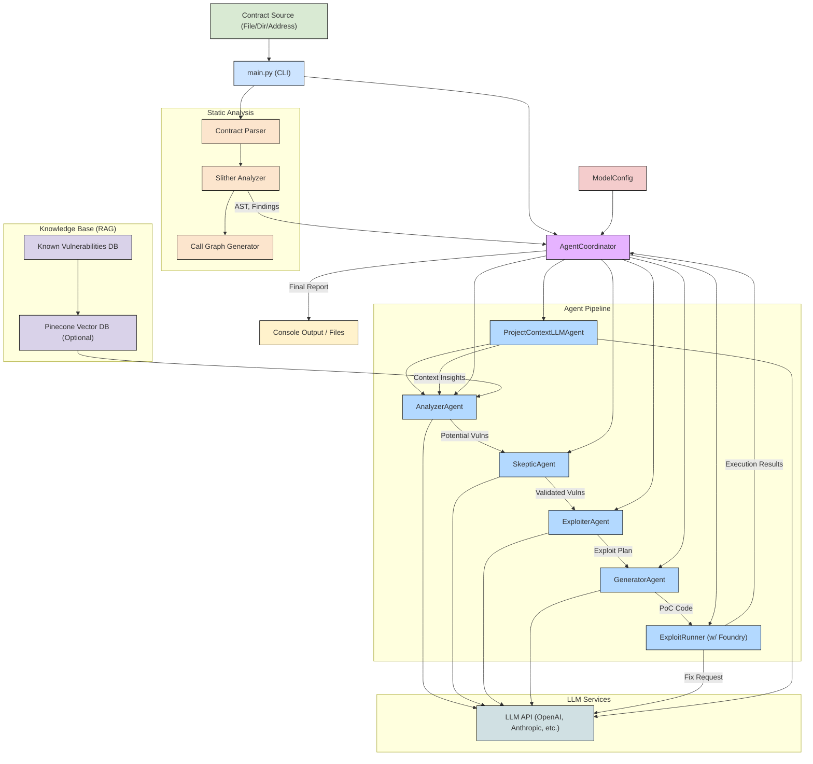

# FYP: Generate Vulnerable Transaction Sequences for Smart Contract using Large Language Models

## AuditAgent: LLM-Powered Smart Contract Vulnerability Analysis & Exploit Generation

**AuditAgent** is an advanced system that leverages a multi-agent Large Language Model (LLM) workflow to automatically analyze smart contracts, identify potential vulnerabilities, and generate proof-of-concept (PoC) exploit code. It integrates static analysis, Retrieval-Augmented Generation (RAG), and a pipeline of specialized AI agents to provide deep security insights.

| Section                                         | Description                                                                     |
| :---------------------------------------------- | :------------------------------------------------------------------------------ |
| [Introduction](#auditagentauditagentauditagentauditagentauditagentauditagentauditagentauditagentauditagentauditagentauditagentauditagentauditagentauditagentauditagentauditagentauditagentauditagentauditagent-llm-powered-smart-contract-vulnerability-analysis--exploit-generation) | Project overview and goals.                                                     |
| [Visual Showcase](#visual-showcase)             | See AuditAgent in action (GUI & CLI).                                           |
| [How It Works](#how-it-works)                   | High-level explanation of the analysis workflow.                                |
| [Core Features](#core-features)                 | Key capabilities of the system.                                                 |
| [Architecture Deep Dive](#architecture-deep-dive) | Detailed system architecture and agent roles.                                   |
| [Prerequisites](#prerequisites)                 | Software and keys needed before installation.                                   |
| [Installation & Setup](#installation--setup)    | Step-by-step guide to get the system running.                                   |
| [Running an Analysis](#running-an-analysis)     | How to use the CLI to analyze contracts.                                        |
| [Command-Line Flags Explained](#command-line-flags-explained) | Detailed breakdown of all available options.                          |
| [Web Frontend](#web-frontend)                   | Details on the interactive web user interface.                                  |
| [Benchmarking and Evaluation](#benchmarking-and-evaluation) | Tools to evaluate system performance.                                 |
| [Understanding the Output](#understanding-the-output) | What files are created and how to interpret the results.                      |
| [Automatic PoC Execution & Fixing](#automatic-poc-execution--fixing) | Details on the automated exploit testing and self-correction feature.         |
| [Troubleshooting](#troubleshooting)             | Solutions for common setup and execution issues.                                |

---

## Visual Showcase

### Web GUI (Example Interface)

*Note: The system includes a web-based frontend in the `frontend_poc` directory. See the [Installation & Setup](#installation--setup) section for instructions on how to run it.*


*(Example: Contract input)*


*(Example: Analysis results)*


*(Example: Vulnerability details)*


*(Example: Generated PoC)*

### Command-Line Interface (CLI) Output

AuditAgent provides rich, real-time feedback directly in your terminal:

https://github.com/user-attachments/assets/8360a8b6-4ca0-49d3-be3c-94c195b3c5a3

---

## How It Works

AuditAgent follows a sophisticated pipeline to analyze smart contracts:

1.  **Input:** You provide a Solidity smart contract file, a directory of contracts, or a contract address on a supported blockchain.
2.  **Static Analysis:** The system uses **Slither** to parse the contract(s), understand the code structure, identify function calls, and perform initial checks based on predefined patterns. If analyzing a multi-file project, it identifies inter-contract relationships.
3.  **LLM-Powered Analysis (Multi-Agent Pipeline):**
    *   **(Optional) Project Context:** If multiple contracts are involved, the `ProjectContextLLMAgent` analyzes interactions between them.
    *   **Vulnerability Identification (`AnalyzerAgent`):** This agent analyzes the code, leveraging static analysis results and (optionally) a **RAG** system (Pinecone Vector DB) containing known vulnerability patterns to identify potential weaknesses.
    *   **Validation (`SkepticAgent`):** To minimize false positives, this agent critically reviews the initial findings, assessing exploitability and business logic context.
    *   **Exploit Planning (`ExploiterAgent`):** For high-confidence vulnerabilities, this agent devises a step-by-step plan to exploit the weakness.
    *   **PoC Generation (`GeneratorAgent`):** Translates the exploit plan into a runnable **Foundry** test contract (Proof of Concept).
    *   **Execution & Fixing (`ExploitRunner`):** Automatically runs the generated PoC using Foundry. If the test fails, it attempts to **fix the exploit code** using the LLM and retries (up to a configurable limit).
4.  **Output:** The system reports the validated vulnerabilities, generated PoC code, execution results (success/failure, fix attempts), and optionally generates Markdown/JSON reports.

---

## Core Features

*   **Multi-Agent LLM Workflow:** Specialized agents collaborate for detection, validation, and exploit generation.
*   **Static Analysis Integration:** Leverages Slither for robust initial code understanding.
*   **RAG Enhancement (Optional):** Improves detection by comparing against a knowledge base of known vulnerabilities (via Pinecone).
*   **Multi-Contract Project Analysis:** Understands and analyzes interactions between multiple contracts in a project.
*   **Blockchain Integration:** Can fetch and analyze contracts directly from Ethereum, BSC, Base, and Arbitrum.
*   **Automatic PoC Generation:** Creates Foundry test files demonstrating exploits.
*   **Self-Correcting PoC Execution:** Automatically runs and attempts to fix generated exploit code.
*   **Flexible LLM Configuration:** Supports various models (OpenAI, Anthropic, etc.) and allows different models per agent.
*   **Comprehensive Benchmarking:** Tools to evaluate vulnerability detection and exploit generation performance.
*   **Web-Based User Interface:** Interactive frontend for visualization of analysis process and results.
*   **Detailed Reporting:** Provides console output, Markdown reports, and JSON exports.
*   **Performance Tracking:** Logs token usage and execution time for analysis.

---

## Architecture Deep Dive

The system combines static analysis tools with a chain of LLM agents coordinated by the `AgentCoordinator`.



*   **Static Analysis:** `slither-analyzer` parses the code, identifies structure, and runs basic detectors.
*   **RAG System:** If enabled (`--no-rag` not used), the `AnalyzerAgent` queries Pinecone (populated with `known_vulnerabilities/contract_vulns.json`) for similar known issues to improve context.
*   **Agent Pipeline:** The `AgentCoordinator` passes the contract info and context through the specialized agents (`Analyzer`, `Skeptic`, `Exploiter`, `Generator`, `Runner`). Each agent uses LLMs via the configured `ModelConfig`.
*   **Foundry Integration:** The `ExploitRunner` uses `forge test` to execute the generated PoC `.sol` files located in the `exploit/` directory.

---

## Prerequisites

Before you begin, ensure you have the following installed and configured:

1.  **Python:** Version 3.8 or higher.
2.  **pip:** Python package installer.
3.  **Git:** For cloning the repository.
4.  **Solidity Compiler & Version Manager (`solc-select`):** Required by Slither to compile contracts. Install it via pip:
    ```bash
    pip install solc-select
    solc-select install 0.8.0 # Or other versions needed by contracts
    solc-select use 0.8.0   # Set a default version
    ```
5.  **Slither:** Smart contract static analyzer. Follow the official [Slither installation guide](https://github.com/crytic/slither#installation). Often requires Node.js/npm for certain dependencies. Like the OpenZeppelin contracts
6.  **Foundry:** Fast, portable, and modular toolkit for Ethereum application development (used for PoC execution). Install via:
    ```bash
    curl -L https://foundry.paradigm.xyz | bash
    foundryup
    ```
    Verify installation: `forge --version`
7.  **API Keys:**
    *   **LLM Provider:** At least one API key (e.g., OpenAI, Anthropic) saved in your environment. See [Installation](#set-up-environment-variables).
    *   **(Optional) Blockchain Explorer:** API keys for Etherscan, BscScan, BaseScan, ArbiScan if using the `--contract-address` feature. Add these to your `.env` file (e.g., `ETHERSCAN_API_KEY=YourKey`).
    *   **(Optional) Pinecone:** API key and environment name if using the RAG feature with Pinecone. Add `PINECONE_API_KEY` and `PINECONE_ENV` to your `.env` file.

---

## Installation & Setup

1.  **Clone the Repository:**
    ```bash
    git clone https://github.com/your-username/fyp-fr.git # Replace with your repo URL
    cd fyp-fr
    ```

2.  **Initialize Foundry Project & Submodules:**
    The generated exploits rely on Foundry's standard library (`forge-std`). Initialize the `exploit` directory as a Foundry project and pull the necessary submodule:
    ```bash
    cd exploit
    forge init --no-git # Initialize Foundry without creating a new git repo
    git submodule update --init --recursive # Pull forge-std defined in .gitmodules
    cd ..
    ```
    *(Note: If `forge init` complains about an existing directory, you might need to remove the `exploit/lib` directory first if it exists.)*

3.  **Create Python Virtual Environment:**
    ```bash
    python3 -m venv .venv
    source .venv/bin/activate # On Windows use `.venv\Scripts\activate`
    ```

4.  **Install Python Dependencies:**
    ```bash
    pip install -r requirements.txt
    ```

5.  **Set Up Environment Variables:**
    Create a `.env` file in the project root directory (`fyp-fr/`). Add your API keys:
    ```dotenv
    # --- LLM Keys ---
    OPENAI_API_KEY="sk-YourOpenAIKeyHere"
    # ANTHROPIC_API_KEY="YourAnthropicKeyHere" # If using Claude models
    # DEEPSEEK_API_KEY="YourDeepSeekKeyHere" # If using DeepSeek models

    # --- Blockchain Explorer Keys (Optional - for fetching contracts) ---
    # ETHERSCAN_API_KEY="YourEtherscanKeyHere"
    # BSCSCAN_API_KEY="YourBscScanKeyHere"
    # BASESCAN_API_KEY="YourBaseScanKeyHere"
    # ARBISCAN_API_KEY="YourArbiScanKeyHere"

    # --- Pinecone Key (Optional - for RAG) ---
    # PINECONE_API_KEY="YourPineconeKeyHere"
    # PINECONE_ENV="YourPineconeEnvironmentHere" # e.g., us-west1-gcp
    ```
    *Only include keys for the services you intend to use.*

6.  **Install Solidity Compiler**:
   ```bash
   pip install solc-select
   solc-select install 0.8.0  # Or the version needed
   solc-select use 0.8.0  # Set as default
   ```

7.  **Initialize Pinecone Index (Optional - for RAG):**
    If you plan to use the RAG feature (`--no-rag` is *not* specified), you need to populate the Pinecone index. This typically involves running a separate script (check `rag/doc_db.py` or similar) to process the `known_vulnerabilities/contract_vulns.json` file and upload embeddings. Ensure your `.env` file has `PINECONE_API_KEY` and `PINECONE_ENV`. The system might attempt to create the index (`fyp` by default) if it doesn't exist when first run with RAG enabled.

8.  **Verify Installations:**
    ```bash
    python --version
    pip --version
    slither --version
    forge --version
    solc --version
    ```

---

## Running an Analysis

Execute the main script from the project's root directory (`fyp-fr/`).

**1. Analyzing a Local Contract File:**

```bash
python main.py --contract examples/VulnerableLendingContract.sol
```

**2. Analyzing a Local Multi-File Project Directory:**

Provide the path to the directory containing your `.sol` files. AuditAgent will use Slither to analyze the project structure and the `ProjectContextLLMAgent` to understand inter-contract relationships.

```bash
# Assumes MyProject/ contains ContractA.sol, ContractB.sol, IContract.sol etc.
python main.py --contract path/to/MyProject/
```
*The system will attempt to identify a primary contract file within the directory for context but analyzes all files for interactions.*

**3. Fetching and Analyzing a Contract from Blockchain:**

```bash
# Analyze a contract on Ethereum mainnet
python main.py --contract-address 0xYourContractAddressHere --network ethereum

# Analyze on Base and save preserve project structure for Project Context Agent (if multi-file source)
python main.py --contract-address 0xAnotherAddressHere --network base --save-separate
```
*Requires the relevant Blockchain Explorer API key in your `.env` file.*

**4. Using Specific Models:**

```bash
# Use GPT-4o for all agents
python main.py --all-models o3-mini --contract benchmark_data/contracts/with_errors/access_control/Voting.sol

# Use different models for different agents
python main.py \
  --analyzer-model claude-3-7-sonnet-latest \
  --skeptic-model o3-mini \
  --generator-model claude-3-7-sonnet-latest \
  --contract benchmark_data/contracts/with_errors/access_control/Voting.sol
```

**5. Controlling PoC Generation and Execution:**

```bash
# Analyze but don't generate PoC code (stops after exploit plan)
python main.py --skip-poc --contract examples/VulnerableLendingContract.sol

# Generate PoC but don't run it automatically
python main.py --no-auto-run --contract examples/VulnerableLendingContract.sol

# Generate and run, allow more fix attempts if it fails
python main.py --max-retries 5 --contract examples/VulnerableLendingContract.sol
```

**6. Disabling RAG:**

If you don't have Pinecone set up or want to analyze without the knowledge base:

```bash
python main.py --no-rag --contract examples/VulnerableLendingContract.sol
```

**7. Exporting Results:**

```bash
# Export a Markdown report
python main.py --export-md --contract examples/VulnerableLendingContract.sol

# Export results to a specific JSON file
python main.py --export-json analysis_results.json --contract examples/VulnerableLendingContract.sol
```

**8. Optimizing for Different Scenarios:**

**Quick Analysis (No PoC Generation)**:
```bash
python main.py --skip-poc --no-rag --contract examples/VulnerableLendingContract.sol
```

**Thorough Analysis with High-Quality LLMs**:
```bash
python main.py \
  --analyzer-model claude-3-7-sonnet-latest \
  --skeptic-model claude-3-7-sonnet-latest \
  --generator-model claude-3-7-sonnet-latest \
  --contract examples/VulnerableLendingContract.sol
```

**Analysis with Detailed Reports**:
```bash
python main.py --export-md --export-json results.json --contract examples/VulnerableLendingContract.sol
```

---

## Command-Line Flags Explained

| Flag                    | Argument Type          | Default                               | Description                                                                                                                               |
| :---------------------- | :--------------------- | :------------------------------------ | :---------------------------------------------------------------------------------------------------------------------------------------- |
| `--contract`            | `path`                 | `examples/VulnerableLendingContract.sol` | Path to the local Solidity file **or** directory containing the project to analyze.                                                       |
| `--contract-address`    | `string`               | None                                  | Fetches contract source code from the specified blockchain address. Use with `--network`. Overrides `--contract` if both are provided. |
| `--network`             | `string`               | `ethereum`                            | Blockchain network to use when fetching (`ethereum`, `bsc`, `base`, `arbitrum`).                                                          |
| `--save-separate`       | (flag)                 | False                                 | When fetching a multi-file contract (`--contract-address`), also save the individual `.sol` files to a `_contracts` subdirectory.      |
| `--analyzer-model`      | `string`               | `o3-mini`                             | LLM model name for the AnalyzerAgent.                                                                                                     |
| `--skeptic-model`       | `string`               | `o3-mini`                             | LLM model name for the SkepticAgent.                                                                                                      |
| `--exploiter-model`     | `string`               | `o3-mini`                             | LLM model name for the ExploiterAgent.                                                                                                    |
| `--generator-model`     | `string`               | `o3-mini`                             | LLM model name for the GeneratorAgent (and for fixing PoCs).                                                                              |
| `--context-model`       | `string`               | `o3-mini`                             | LLM model name for the ProjectContextLLMAgent.                                                                                            |
| `--all-models`          | `string`               | None                                  | Use this specified LLM model for *all* agents, overriding individual settings.                                                            |
| `--api-base`            | `url`                  | None                                  | Custom base URL for the LLM API (e.g., for proxies or local models compatible with OpenAI API spec).                                        |
| `--no-rag`              | (flag)                 | False                                 | Disable Retrieval-Augmented Generation. The AnalyzerAgent will not query the Pinecone knowledge base.                                     |
| `--skip-poc`            | (flag)                 | False                                 | Stop the analysis after the `ExploiterAgent` generates the plan. Do not generate or run PoC code.                                          |
| `--no-auto-run`         | (flag)                 | False                                 | Generate PoC code but do not automatically execute it using Foundry.                                                                      |
| `--max-retries`         | `integer`              | `3`                                   | Maximum number of times the `ExploitRunner` will attempt to fix a failing PoC test using the LLM.                                          |
| `--export-md`           | (flag)                 | False                                 | Generate a detailed analysis report in Markdown format in the root directory.                                                              |
| `--export-json`         | `path`                 | None                                  | Export detailed analysis results (vulnerabilities, PoCs, execution status) to the specified JSON file path.                                |

---

## Web Frontend

AuditAgent includes a web-based frontend interface that provides a user-friendly way to interact with the system, visualize the analysis process, and explore results.

### Setup and Installation

To set up the web frontend:

1. **Navigate to the frontend directory**:
   ```bash
   cd frontend_poc
   ```

2. **Install backend dependencies**:
   ```bash
   pip install flask flask-socketio flask-cors
   ```

3. **Start the backend server**:
   ```bash
   python app.py
   ```

4. **Install frontend dependencies** (in a separate terminal):
   ```bash
   cd frontend_poc/client
   npm install
   ```

5. **Start the development server**:
   ```bash
   npm start
   ```

   Or use the pre-built version:
   ```bash
   # The backend will serve the pre-built frontend from the client/build directory
   # Just run app.py and navigate to http://localhost:5000
   ```

### Key Features

The web frontend provides several advantages over the command-line interface:

1. **Interactive Contract Input**:
   - Upload local Solidity files through drag-and-drop
   - Fetch contracts directly from blockchain by address
   - Support for multi-file project uploads

2. **Customizable Analysis Configuration**:
   - Select different LLM models for each agent
   - Toggle RAG functionality
   - Configure PoC generation and execution settings

3. **Real-Time Process Visualization**:
   - Live agent activity indicators
   - Step-by-step workflow visualization
   - Progress tracking for each analysis stage

4. **Enhanced Results Exploration**:
   - Interactive vulnerability cards with expandable details
   - Syntax-highlighted code with vulnerability locations
   - Collapsible exploit plans and PoC code
   - Execution status indicators for generated exploits

5. **Project Context Insights** (for multi-contract projects):
   - Contract relationship visualization
   - Cross-contract vulnerability highlighting
   - Statistics and recommendations for complex projects

### Architecture

The architecture follows a client-server model:

1. **Backend** (Flask + Flask-SocketIO):
   - Interfaces with the core AuditAgent system
   - Provides RESTful API endpoints
   - Implements real-time communication with WebSockets
   - Manages analysis jobs and their states

2. **Frontend** (React):
   - Responsive user interface built with React and Tailwind CSS
   - Real-time updates using Socket.io client
   - Interactive visualization with React Flow
   - Code highlighting with Prism.js

### API Endpoints

The frontend server exposes several API endpoints:

| Endpoint | Method | Description |
|----------|--------|-------------|
| `/api/upload-contract` | POST | Upload a Solidity file or project |
| `/api/fetch-contract` | POST | Fetch contract from blockchain by address |
| `/api/analyze` | POST | Start analysis with specified options |
| `/api/status/:jobId` | GET | Get analysis status for a specific job |
| `/api/results/:jobId` | GET | Get complete analysis results |
| `/api/performance/:jobId` | GET | Get performance metrics for an analysis |

### WebSocket Events

The system uses WebSocket for real-time updates:

| Event | Direction | Description |
|-------|-----------|-------------|
| `agent_active` | Server → Client | Notifies when an agent starts working |
| `agent_status` | Server → Client | Updates on agent progress |
| `agent_complete` | Server → Client | Indicates when an agent finishes |
| `vulnerability_detected` | Server → Client | Real-time vulnerability notifications |
| `exploit_status` | Server → Client | Updates on PoC generation and execution |
| `analysis_complete` | Server → Client | Signals the end of the analysis process |

### Usage Example

To analyze a contract using the web frontend:

1. Open the frontend in a web browser
2. Upload a contract file or enter a blockchain address
3. Configure the analysis options (models, RAG, etc.)
4. Click "Start Analysis"
5. Watch the real-time analysis process
6. Explore the detailed results when complete

---

## Benchmarking and Evaluation

AuditAgent includes two powerful benchmarking scripts for evaluating system performance:

### CTFBench Evaluator

The `ctfbench_evaluator.py` script evaluates vulnerability detection performance using the CTFBench methodology:

```bash
python ctfbench_evaluator.py --models o3-mini claude-3-7-sonnet-latest --rag both
```

**Key Metrics**:
- **VDR (Vulnerability Detection Rate)**: Proportion of vulnerabilities correctly identified
- **OI (Overreporting Index)**: False positives per line of code

#### Command Options

| Option                  | Description                                           |
|-------------------------|-------------------------------------------------------|
| `--uploads-dir`         | Directory containing generated reports                |
| `--benchmark-data-dir`  | Directory containing benchmark data                   |
| `--results-dir`         | Directory to save evaluation results                  |
| `--report-dirs`         | Specific report directories to evaluate               |
| `--use-llm`/`--no-llm`  | Enable/disable LLM-based evaluation                   |
| `--eval-model`          | LLM model to use for evaluation                       |
| `--eval-runs`           | Number of independent trials for evaluation           |
| `--load-results`        | Path to existing results file to visualize            |

### Exploit Success Evaluator

The `exploit_success_evaluator.py` script measures the system's ability to generate and execute working exploits:

```bash
python exploit_success_evaluator.py --models o3-mini claude-3-7-sonnet-latest --rag both
```

**Key Metrics**:
- **Detection Rate**: Percentage of vulnerabilities detected
- **Generation Rate**: Percentage of detected vulnerabilities with generated exploits
- **Success Rate**: Percentage of generated exploits that execute successfully
- **Overall Success Rate**: Percentage of contracts with successful exploits

#### Command Options

| Option                  | Description                                           |
|-------------------------|-------------------------------------------------------|
| `--benchmark-data-dir`  | Directory containing benchmark data                   |
| `--results-dir`         | Directory to save evaluation results                  |
| `--max-workers`         | Maximum number of parallel workers                    |
| `--categories`          | Specific vulnerability categories to evaluate         |
| `--models`              | Models to evaluate                                    |
| `--rag`                 | RAG configuration (`on`, `off`, or `both`)            |
| `--load-results`        | Path to existing results file to visualize            |
| `--example-contract`    | Run evaluation on a single contract file              |

### Performance Analysis

The system also logs detailed performance metrics for each run, including:
- Token usage by agent and model
- Lines of code analyzed
- Execution time by stage

Performance data is saved to `performance_metrics_<timestamp>.json` files, which can be found in the `performance_analysis/` directory.

---

## Understanding the Output

AuditAgent generates several outputs:

1.  **Console Output:**
    *   Real-time progress updates from each agent.
    *   Configuration details.
    *   Static analysis findings summary.
    *   Detected vulnerabilities with confidence scores and reasoning.
    *   PoC generation status and file paths.
    *   PoC execution results (`SUCCESS`/`FAILED`, retries, errors).
    *   Final performance metrics (token usage, time).

2.  **Generated Files:**
    *   **Proof of Concept (PoC) Files:**
        *   **Location:** `exploit/src/test/`
        *   **Naming:** `PoC_<VulnerabilityType>_<Timestamp>.sol`
        *   **Content:** A Foundry test contract designed to exploit a specific vulnerability. Imports `basetest.sol`.
        *   **Base Test File:** `exploit/src/test/basetest.sol` is generated if it doesn't exist. It provides helper functions and logging for the PoCs.
    *   **Markdown Report (`--export-md`):**
        *   **Location:** Project root directory.
        *   **Naming:** `analysis_report_<ContractName>_<Timestamp>.md`
        *   **Content:** A comprehensive report including contract details, vulnerability summary table, detailed analysis for each vulnerability (reasoning, code snippets, exploit plan), PoC status, and general recommendations.
    *   **JSON Report (`--export-json <path>`):**
        *   **Location:** Path specified by the user.
        *   **Content:** Structured data containing all analysis results, including vulnerability details, PoC plans, generated code paths, and execution status. Useful for programmatic integration.
    *   **Fetched Contract Files (if using `--contract-address`):**
        *   **Location:** `uploads/` directory by default.
        *   **Naming:** `<ContractAddress>_<Network>.sol` (flattened)
        *   **Subdirectory (if `--save-separate`):** `uploads/<ContractAddress>_<Network>_contracts/` containing individual source files.
    *   **Performance Metrics:**
        *   **Location:** Project root directory.
        *   **Naming:** `performance_metrics_<Timestamp>.json`
        *   **Content:** Detailed breakdown of LLM token usage per agent/model, code metrics (lines analyzed), and time taken per stage.

3.  **Interpreting Results:**
    *   **Confidence Scores:** Pay close attention to the `skeptic_confidence` score (0.0 - 1.0). Higher scores indicate greater certainty after validation. Scores > 0.5 typically warrant investigation.
    *   **Reasoning & Validation:** Read the `reasoning` (initial finding) and `validity_reasoning` (skeptic's assessment) to understand *why* something is flagged.
    *   **PoC Status:**
        *   `SUCCESS`: The generated exploit worked as intended.
        *   `FAILED`: The exploit failed, even after fix attempts. Review the error and the PoC code (`exploit/src/test/...`).
        *   `SKIPPED`: PoC generation or execution was disabled (`--skip-poc` or `--no-auto-run`).

---

## Automatic PoC Execution & Fixing

A key feature is the `ExploitRunner`'s ability to test and self-correct generated PoCs:

1.  **Execution:** After `GeneratorAgent` creates a `.sol` file in `exploit/src/test/`, the `ExploitRunner` executes `forge test --match-path <PoC_File_Path>` within the `exploit/` directory.
2.  **Error Detection:** If the `forge test` command fails (non-zero exit code or specific failure patterns in output), the runner extracts the relevant error messages from `stdout`/`stderr`.
3.  **LLM Correction:** The failing code, along with the error message, is sent back to the LLM (using the `generator_model`) with a prompt asking it to fix the code.
4.  **Retry:** The corrected code overwrites the original PoC file, and the `forge test` command is executed again.
5.  **Loop:** This process repeats up to `--max-retries` times (default 3).
6.  **Reporting:** The final status (SUCCESS or FAILED), the number of retries, and the last error message (if failed) are reported.

This loop helps overcome common LLM generation errors (syntax issues, incorrect logic, missing imports, setup problems like insufficient funds) automatically.

---

## Troubleshooting

### Common Issues

| Issue                       | Solution                                                                                       |
|-----------------------------|------------------------------------------------------------------------------------------------|
| Slither analysis failed     | Ensure correct Solidity version is installed and selected via `solc-select`                    |
| API Key Error               | Verify API key in `.env` file and check correct environment variable name                       |
| Foundry command not found   | Ensure Foundry is installed correctly and run `foundryup`                                      |
| PoC tests fail              | Check error messages, examine PoC file, try increasing `--max-retries`                         |
| RAG errors                  | Verify Pinecone credentials or use `--no-rag` to bypass                                        |
| Slow performance            | Use faster models (e.g., `o3-mini`) or `--skip-poc` to avoid generation                         |

### Optimizing Performance

1. **Model Selection**: Use smaller models (like `o3-mini`) for faster analysis
2. **RAG Usage**: Disable RAG with `--no-rag` if not needed
3. **PoC Generation**: Use `--skip-poc` if you only need vulnerability analysis
4. **Selective Agents**: Configure minimal agents needed for your specific use case

### Resource Monitoring

The system tracks token usage and performance metrics for each run:

1. Check `performance_metrics_<timestamp>.json` files
2. Review token usage by agent to optimize model selection
3. Monitor execution time by stage to identify bottlenecks
