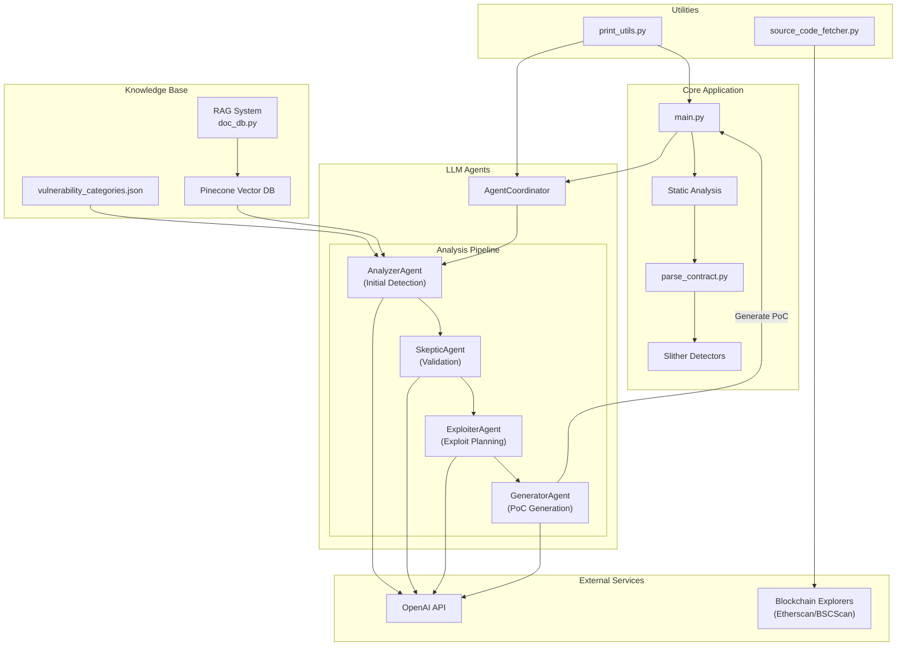

# Generate Vulnerable Transaction Sequences for Smart Contract using Large Language Models

This project utilises a multi-agent workflow to identify vulnerabilities and generate transactions to exploit them. In future iterations we will run these exploits in a sandbox VM to demonstrate them.

## Features

- **Static Analysis**: Utilizes Slither to parse and analyze Solidity contracts, extracting function details and generating call graphs.
- **Knowledge Base**: Stores vulnerability information using FAISS for efficient similarity searches, enabling contextual analysis.
- **LLM Integration**: Supports multiple LLM providers (OpenAI, Anthropic, Ollama) with automatic prompt format optimization.
- **Agent Coordination**: Coordinates between analysis agents to provide comprehensive vulnerability assessments and exploit recommendations.
- **Model Flexibility**: Configure different models for each agent based on task complexity and performance requirements.

## Architecture

The project is divided into two main components:

1. **Static Analysis**: Parses and analyzes Solidity contracts to extract detailed information and detect potential issues.
2. **LLM Agents**: Uses language models to interpret static analysis results, identify vulnerabilities, and suggest exploit strategies.



## Prerequisites

- Python 3.8+
- Solidity Compiler (for Slither)
- OpenAI API Key
- [Slither](https://github.com/crytic/slither) installed

## Installation

1. **Clone the Repository**

   ```bash
   git clone https://github.com/your-username/llm_agents.git
   cd llm_agents
   ```

2. **Create a Virtual Environment**

   ```bash
   python3 -m venv venv
   source venv/bin/activate
   ```

3. **Install Dependencies**

   ```bash
   pip install -r requirements.txt
   ```

4. **Set up Slither**

   Follow the [Slither installation guide](https://github.com/crytic/slither#installation) to install Slither and its dependencies.

5. **Set Up Environment Variables**

   Create a `.env` file in the project root and add your OpenAI API key:

   ```env
   OPENAI_API_KEY=your_openai_api_key_here
   ```

   Alternatively, export it directly in your shell:

   ```bash
   export OPENAI_API_KEY=your_openai_api_key_here
   ```

## Usage

1. **Prepare Solidity Contracts**

   Place your Solidity contracts in the `static_analysis/test_contracts/` directory. Sample contracts are provided for testing purposes.

2. **Set your Solidity Compiler Version**

    Based on the Solidity version used in your contracts, install the corresponding compiler version using `solc-select`:

    ```python
    solc-select install 0.8.0
    solc-select use 0.8.0
    ```

3. **Run the Analysis**

   Execute the main script to perform static analysis and vulnerability assessment:

   Basic usage with default models (o1-mini):
   ```bash
   python main.py --contract path/to/your/contract.sol
   ```

   Configure which models to use for each agent:
   ```bash
   # Use the same model for all agents
   python main.py --all-models gpt-4o --contract path/to/your/contract.sol

   # Configure individual agents with different models
   python main.py \
     --analyzer-model gpt-4o \
     --skeptic-model gpt-3.5-turbo \
     --exploiter-model claude-3-haiku-20240307 \
     --generator-model o1-preview \
     --contract path/to/your/contract.sol

   # Configure API base URL (useful for proxies)
   python main.py --api-base https://your-proxy.com/v1 --all-models gpt-4
   ```

   Auto-run execution options:
   ```bash
   # Disable automatic execution of PoCs
   python main.py --no-auto-run --contract path/to/your/contract.sol

   # Set maximum number of fix attempts for failing tests
   python main.py --max-retries 5 --contract path/to/your/contract.sol
   ```

   The script will:

   - Parse the Solidity contract using Slither.
   - Extract function details and generate a call graph.
   - Analyze the contract against the knowledge base for known vulnerabilities.
   - Use LLM agents to generate a comprehensive vulnerability report and exploit plan.

4. **View Results**

   The analysis results will be printed to the console, detailing detected vulnerabilities, confidence scores, reasoning, and suggested exploit transactions.

## Automatic PoC Execution and Fixing

The system includes a self-correction mechanism for generated proof-of-concept exploits:

### Features
- **Auto-run**: Automatically executes generated PoC tests after creation
- **Error Detection**: Intelligently identifies and extracts error information from test failures
- **Self-correction**: Uses the same LLM to fix broken test code based on error messages
- **Multiple Retries**: Attempts up to 3 fixes by default (configurable with `--max-retries`)
- **Detailed Reporting**: Reports execution status, error messages, and fix attempts

### Troubleshooting Common Issues
The system automatically addresses common errors in generated tests:
- Missing funds for transactions (adding vm.deal statements)
- Incorrect function calls or parameters
- Arithmetic errors like overflow/underflow
- State inconsistencies across transactions
- Solidity version compatibility issues
- Import errors and contract initialization problems

## Supported Models

The system automatically adapts prompt structures based on model capabilities:

### Reasoning-capable Models
These models support system/user message separation and complex reasoning:
- OpenAI: gpt-3.5-turbo, gpt-4, gpt-4-turbo, gpt-4o
- Anthropic: claude-3-opus-20240229, claude-3-sonnet-20240229, claude-3-haiku-20240307
- Ollama: o1-preview

### Simple Models
These models work best with direct prompting:
- Ollama: o1-mini

To add support for additional models, update the `is_reasoning_model` dictionary in `llm_agents/config.py`.
