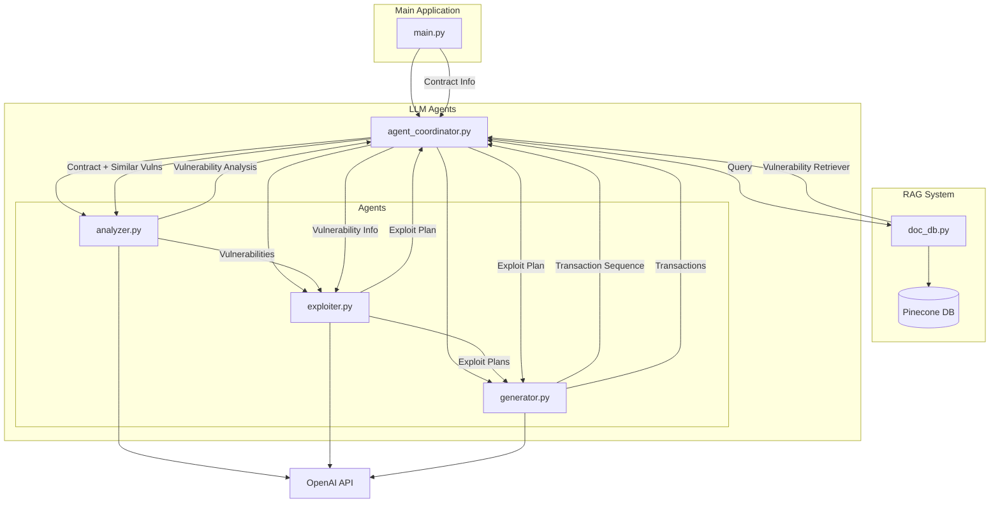

# Generate Vulnerable Transaction Sequences for Smart Contract using Large Language Models

This project utilises a multi-agent workflow to identify vulnerabilities and generate transactions to exploit them. In future iterations we will run these exploits in a sandbox VM to demonstrate them.

## Features

- **Static Analysis**: Utilizes Slither to parse and analyze Solidity contracts, extracting function details and generating call graphs.
- **Knowledge Base**: Stores vulnerability information using FAISS for efficient similarity searches, enabling contextual analysis.
- **LLM Integration**: Employs OpenAI's GPT-3.5-turbo to analyze detected vulnerabilities and propose exploit strategies.
- **Agent Coordination**: Coordinates between analysis agents to provide comprehensive vulnerability assessments and exploit recommendations.

## Architecture

The project is divided into two main components:

1. **Static Analysis**: Parses and analyzes Solidity contracts to extract detailed information and detect potential issues.
2. **LLM Agents**: Uses language models to interpret static analysis results, identify vulnerabilities, and suggest exploit strategies.



## Prerequisites

- Python 3.8+
- Solidity Compiler (for Slither)
- OpenAI API Key
- [Slither](https://github.com/crytic/slither) installed

## Installation

1. **Clone the Repository**

   ```bash
   git clone https://github.com/your-username/llm_agents.git
   cd llm_agents
   ```

2. **Create a Virtual Environment**

   ```bash
   python3 -m venv venv
   source venv/bin/activate
   ```

3. **Install Dependencies**

   ```bash
   pip install -r requirements.txt
   ```

4. **Set up Slither**

   Follow the [Slither installation guide](https://github.com/crytic/slither#installation) to install Slither and its dependencies.

5. **Set Up Environment Variables**

   Create a `.env` file in the project root and add your OpenAI API key:

   ```env
   OPENAI_API_KEY=your_openai_api_key_here
   ```

   Alternatively, export it directly in your shell:

   ```bash
   export OPENAI_API_KEY=your_openai_api_key_here
   ```

## Usage

1. **Prepare Solidity Contracts**

   Place your Solidity contracts in the `static_analysis/test_contracts/` directory. Sample contracts are provided for testing purposes.

2. **Set your Solidity Compiler Version**

    Based on the Solidity version used in your contracts, install the corresponding compiler version using `solc-select`:

    ```python
    solc-select install 0.8.0
    solc-select use 0.8.0
    ```

3. **Run the Analysis**

   Execute the main script to perform static analysis and vulnerability assessment:

   ```bash
   python main.py
   ```

   The script will:

   - Parse the Solidity contract using Slither.
   - Extract function details and generate a call graph.
   - Analyze the contract against the knowledge base for known vulnerabilities.
   - Use LLM agents to generate a comprehensive vulnerability report and exploit plan.

4. **View Results**

   The analysis results will be printed to the console, detailing detected vulnerabilities, confidence scores, reasoning, and suggested exploit transactions.
