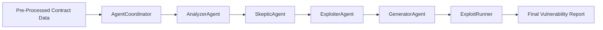
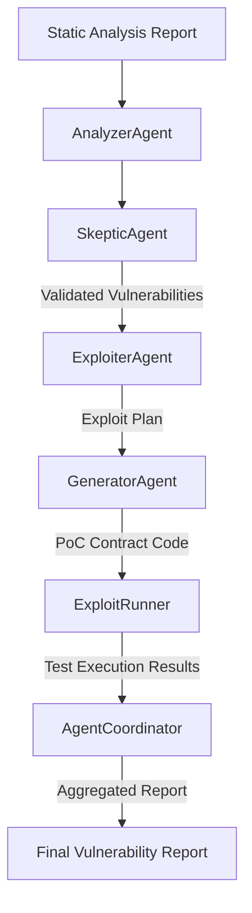

# LLM Agents Sub-Component

This document describes the LLM Agents part of the project. This component is responsible for leveraging large language models to perform vulnerability detection, validation, exploit planning, and proof-of-concept (PoC) generation based on the analysis provided by the static analysis and RAG systems.

## Overview

The LLM Agents are organized as a pipeline managed by the AgentCoordinator. The main agents include:

- **AnalyzerAgent**: Performs the initial vulnerability detection using both direct static analysis results and Retrieval-Augmented Generation (RAG) enhancements.
- **SkepticAgent**: Validates the findings from the AnalyzerAgent to reduce false positives via re-auditing of detected vulnerabilities.
- **ExploiterAgent**: Develops exploit strategies for the vulnerabilities validated by the SkepticAgent.
- **GeneratorAgent**: Generates concrete Proof-of-Concept (PoC) exploits based on the strategies provided by the ExploiterAgent.
- **ExploitRunner**: Executes and validates the generated exploits to confirm their viability.

The AgentCoordinator orchestrates these agents and integrates their outputs into a comprehensive vulnerability report.

## Workflow

1. **Input**: The pre-processed smart contract data from the static analysis layer is provided to the AgentCoordinator.
2. **Detection**: The AnalyzerAgent processes the input using an LLM to identify potential vulnerabilities and retrieves similar cases via a RAG setup.
3. **Validation**: The SkepticAgent re-audits these vulnerabilities for accuracy.
4. **Exploit Planning**: The ExploiterAgent formulates potential exploit plans on validated vulnerabilities.
5. **PoC Generation**: The GeneratorAgent converts exploit plans into executable PoC code.
6. **Execution**: The ExploitRunner runs and verifies the exploit code, providing feedback on the exploitation success.
7. **Reporting**: The AgentCoordinator aggregates all results into a final vulnerability report.

## Mermaid Diagram

## How to Run

- Ensure that you have configured the appropriate LLM API keys (e.g., OpenAI API Key).
- Configure the `ModelConfig` to use the desired models for each agent.
- Execute the main script (e.g., `python main.py`) which triggers the overall workflow using the AgentCoordinator.

## Additional Notes

- Each agent is designed to perform a highly specific task, thus enabling flexibility in model choice and tuning.
- Logging and error handling are incorporated to facilitate debugging and improve traceability.
- The system allows for modifications where the output from one agent feeds into the next stage, enabling a robust and scalable pipeline.

# LLM Agents Sub-Component - In-Depth Overview

This document provides a detailed look at the LLM Agents component, which leverages large language models to support vulnerability detection, validation, exploit planning, and proof-of-concept (PoC) generation based on inputs from both static analysis and a RAG system.

## Overview

The LLM Agents pipeline consists of several specialized agents, orchestrated by the `AgentCoordinator`. Each agent is designed to perform a specific task with custom prompts and rigorous response validations. The main agents include:

- **AnalyzerAgent**: Conducts the initial vulnerability detection using a combination of raw static analysis outputs and Retrieval-Augmented Generation (RAG) enhancements. (Details not covered here.)
- **SkepticAgent**: Re-audits vulnerabilities to filter false positives and re-rank findings. 
- **ExploiterAgent**: Develops an educational exploitation plan that illustrates how a vulnerability might be theoretically exploited.
- **GeneratorAgent**: Converts the exploit plan into a complete, compilable Proof-of-Concept (PoC) contract using Foundry's testing framework.
- **ExploitRunner**: (Not detailed in these files) Executes the generated PoC to validate the exploit in a controlled environment.

## Agent Breakdown

### SkepticAgent

**File**: `llm_agents/agents/skeptic.py`

- **Purpose**: To re-check initial vulnerability findings by assessing them in-depth. This involves evaluating business logic, preconditions, and practical impacts.
- **Implementation Details**:
  - **Initialization**: 
    - Loads the chosen LLM model using settings from `ModelConfig`.
    - Establishes an OpenAI client with credentials retrieved via environment variables.
  - **Audit Process**:
    - Constructs a detailed system prompt instructing the model to critically assess each vulnerability based on multiple criteria (e.g., business logic context, preconditions, practical impact, code accuracy).
    - The prompt requires that the response includes a confidence score (from 0.0 to 1.0) and clear reasoning.
    - Uses a two-message structure (system and user) if the model supports reasoning, otherwise falls back to a concatenated message.
  - **Response Parsing**:
    - Attempts to parse a JSON object from the LLM output.
    - If JSON parsing fails, uses regex to extract JSON from markdown code blocks.
    - Updates each vulnerability record with a `skeptic_confidence` score and an accompanying `validity_reasoning` explanation.

### ExploiterAgent

**File**: `llm_agents/agents/exploiter.py`

- **Purpose**: To generate an educational exploitation plan for a vulnerability that has passed the skeptical audit.
- **Implementation Details**:
  - **Initialization**:
    - Similar to SkepticAgent, it initializes using credentials from `ModelConfig`.
  - **Prompt Construction**:
    - Gathers detailed vulnerability information including type, confidence score, reasoning, affected functions, and code snippet.
    - Constructs a prompt that instructs the LLM to produce an exploitation plan meant for educational demonstration. Emphasis is placed on clarity and minimalism in showing how the vulnerability could be triggered.
  - **JSON Schema Enforcement**:
    - The response is expected to strictly conform to a predefined JSON schema (`EXPLOIT_SCHEMA`), which includes `setup_steps`, `execution_steps`, and `validation_steps`.
  - **Response Handling**:
    - Uses JSON parsing and, if necessary, regex fallback to extract a valid JSON structure from the LLM response.

### GeneratorAgent

**File**: `llm_agents/agents/generator.py`

- **Purpose**: To generate a complete PoC contract that demonstrates the vulnerability in a controlled, educational manner.
- **Implementation Details**:
  - **Generation Process**:
    - Receives an exploit plan along with detailed vulnerability information.
    - Constructs a highly detailed prompt that includes:
      - The vulnerability type and affected functions.
      - A code snippet illustrating the vulnerability.
      - The educational steps provided in the exploit plan (setup, execution, and validation).
    - The prompt instructs the LLM to generate a Foundry test contract that adheres to specific requirements:
      - It must import necessary dependencies (e.g., `basetest.sol`).
      - It should extend from `BaseTestWithBalanceLog`.
      - The contract must include setup logic (like funding the test contract using `vm.deal`) and employ proper error handling.
      - Comments are required to guide developers on understanding and preventing the vulnerability.
  - **Output Process**:
    - The generated contract code is saved locally and an execution command (using Foundry) is provided.

## Agent Coordination Workflow

The following diagram illustrates the intricate workflow among the agents:

## Configuration and Error Handling

- **ModelConfig**:
  - Acts as a central configuration which specifies which LLM model each agent should use and provides the necessary API keys and model parameters.

- **Error Handling**:
  - Each agent employs progress spinners and logs warnings to ensure that any issues (e.g., JSON parsing errors) are traceable.
  - Multiple fallback mechanisms (e.g., regex-based extraction) are in place to handle non-standard LLM responses.

## Future Enhancements

- Adding additional agents to further refine vulnerability exploitation strategies.
- Improving the robustness of JSON schema validations to catch edge-case responses.
- Enhancing integration with static analysis and RAG systems to provide richer context for LLM prompts.
