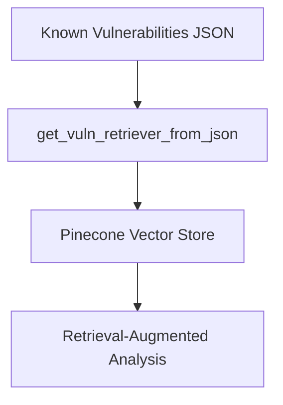

# Retrieval-Augmented Generation (RAG) Component

This document describes the Retrieval-Augmented Generation (RAG) component, which enhances vulnerability analysis by providing contextual information based on historical records of known vulnerabilities. The RAG component ensures that vulnerability detection is informed by previous patterns and data, which in turn refines analysis and subsequent steps in the pipeline.

## Overview

The RAG system integrates with the static analysis and LLM Agents pipelines by retrieving similar vulnerability cases from a pre-indexed database. It functions as follows:

- **Contextual Enhancement**: By referencing a database of known vulnerability instances, the RAG system augments the analysis results for better accuracy and prioritization.
- **Efficient Similarity Search**: Leveraging vector search capabilities, it finds and returns similar vulnerability patterns for any given contract under analysis.

## Key Steps

1. **Initialization**: 
   - The system initializes a Pinecone vector database using environment variables (e.g., `PINECONE_API_KEY` and `PINECONE_ENV`). 
   - If the designated index does not exist, it is created with specified parameters (e.g., cosine similarity, proper vector dimensions).

2. **Data Loading and Chunking**:
   - The component reads vulnerability data from a JSON file. This file contains records of known vulnerabilities including details like vulnerability type, affected lines, and associated metadata.
   - The source code from contracts is split into token-based chunks, preserving metadata that includes vulnerability markers. This ensures that context is maintained.

3. **Vector Store Generation**:
   - The tokenized documents are indexed in the Pinecone vector store, enabling rapid similarity searches for new inputs.

4. **Vulnerability Retriever**:
   - The function `get_vuln_retriever_from_json` is used to update or create the vector store and return a retriever object.
   - This retriever is then used by subsequent components (like the AnalyzerAgent) to query similar vulnerabilities and better inform vulnerability detection and prioritization.

## Mermaid Diagram for RAG Integration

## How to Run (RAG Component)

1. Ensure that your environment variables for Pinecone are set (`PINECONE_API_KEY`, `PINECONE_ENV`).
2. Verify that the JSON vulnerability file exists in the designated location.
3. Run the RAG initialization process (typically integrated within the analysis workflow) which will update or create the Pinecone index.

## Additional Notes

- **Integration**: Although independent, the RAG component outputs contextual data that is fed to the LLM Agents to refine vulnerability detection.
- **Error Handling and Logging**: The RAG system includes mechanisms to log progress, diagnose errors in data loading, and handle cases where the vector store update fails.
- **Scalability**: The vector indexing approach ensures that as more vulnerability data is collected, the system can efficiently scale to accommodate larger datasets.

This README provides the necessary information for understanding and operating the RAG component as a standalone service within the overall project architecture.
