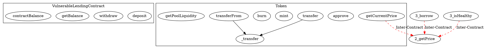

# Chapter 3: System Design and Implementation

## 3.1 Chosen Methodology and Design Rationale

The design of the smart contract vulnerability detection and exploitation system reflects several key decisions that optimize it for the complex task of smart contract security analysis:

### 3.1.1 Multi-Agent Approach

The multi-agent design was chosen for its ability to decompose the complex problem of vulnerability analysis into specialized subtasks. This approach:

1. **Leverages Specialization**: Each agent focuses on a specific aspect of the problem, allowing for deeper expertise in narrower domains.
2. **Implements Checks and Balances**: The Skeptic agent specifically counters the tendency of vulnerability scanners to produce false positives.
3. **Enables Sequential Refinement**: Information flows from general to specific, with each agent adding value to the previous stage's output.

This approach is supported by research in LLM-based agency (Weng, 2023) and cognitive division of labor in complex reasoning tasks (Karpas et al., 2022).

### 3.1.2 Static Analysis Integration

The decision to use Slither as a foundation for LLM analysis was driven by:

1. **Complementary Strengths**: Static analyzers excel at pattern recognition and control flow analysis, while LLMs provide contextual understanding and reasoning.
2. **Computational Efficiency**: Using Slither for initial analysis reduces the computational burden on LLMs.
3. **Structured Guidance**: Slither's output provides structured guidance that helps the LLM focus on relevant code sections.

### 3.1.3 Retrieval-Augmented Generation

The integration of RAG was motivated by:

1. **Factual Grounding**: RAG provides factual examples that reduce hallucination in LLM outputs.
2. **Domain-Specific Knowledge**: The knowledge base contains specialized information about smart contract vulnerabilities that might not be fully represented in general-purpose LLM training.
3. **Efficiency**: Retrieving relevant examples allows the LLM to focus on analyzing similar patterns rather than having to identify patterns from scratch.

### 3.1.4 Executable Proof of Concepts

The system generates executable PoCs rather than just theoretical exploit descriptions because:

1. **Concrete Validation**: Executable PoCs provide concrete validation of vulnerability existence.
2. **Educational Value**: Working demonstrations have superior educational value for developers.
3. **False Positive Reduction**: The requirement for a working exploit significantly reduces false positives.

### 3.1.5 Self-Healing Capabilities

The Runner agent's ability to fix failing PoCs autonomously addresses a common limitation in automated exploit generation:

1. **Practical Robustness**: LLM-generated code often contains minor errors that would otherwise require human intervention.
2. **Learning from Failures**: The system improves its understanding by analyzing failed attempts.
3. **Increased Success Rate**: Iterative improvement significantly increases the success rate of exploit demonstrations.

These design choices collectively enable a system that provides more accurate, actionable, and educational security analysis than either traditional static analyzers or pure LLM-based approaches could achieve independently.

## 3.2 Technology Stack

The system is implemented using a comprehensive stack of modern technologies, chosen for their capabilities and synergies in smart contract security analysis:

| Component | Technology | Description | Justification |
|-----------|------------|-------------|---------------|
| **Core Programming** | Python 3.9+ | Primary language for agent system | Ecosystem of ML/AI libraries, language flexibility |
| | Solidity 0.8.x | Smart contract language | Industry standard for Ethereum contracts |
| | JavaScript/React | Frontend web interface | Modern UI framework with component-based architecture |
| **Smart Contract Analysis** | Slither 1.1.0 | Static analysis framework | Established tool with comprehensive vulnerability detection |
| | Foundry 0.2.0 (Forge, Anvil) | Testing framework | Modern Solidity-based testing environment |
| | Web3.py 6.0.0 | Ethereum interaction | Robust Python library for blockchain interaction |
| **LLM Integration** | OpenAI API | GPT model access | State-of-the-art language models (GPT-4, GPT-4o) |
| | Anthropic API | Claude model access | Alternative provider with strong reasoning capabilities |
| | LangChain 0.1.0 | LLM application framework | Simplifies RAG implementation and agent construction |
| **Vector Database** | Pinecone | Knowledge base storage | High-performance vector database for similarity search |
| | OpenAI Embeddings | Vector representations | Creates semantic embeddings of code and vulnerabilities |
| **Web Interface** | Flask 2.3.3 | API backend | Lightweight framework for Python-based APIs |
| | ReactJS 18.2.0 | Frontend library | Component-based UI with efficient rendering |
| | TailwindCSS 3.3.5 | CSS framework | Utility-first approach for rapid styling |
| **Development Tools** | Poetry 1.6.1 | Dependency management | Modern Python package management |
| | Docker 24.0.5 | Containerization | Reproducible deployment environment |
| | Git 2.40.1 | Version control | Industry standard SCM |

The technology stack was designed for modularity (components can be updated independently), extensibility (new agents or analysis techniques can be added without refactoring), and robustness (industry-standard tools with active maintenance).

## 3.3 Architecture Overview

The smart contract vulnerability detection and exploitation system is designed as a modular, pipeline-based architecture that combines static analysis with advanced LLM-powered agents to detect, validate, and demonstrate vulnerabilities in Solidity smart contracts. Figure 3.1 illustrates the high-level architecture of the system.


*Figure 3.1: System Architecture Overview showing the main components and data flow*

The system processes Solidity smart contracts through the following stages:

1. **Input Processing**: The system accepts single Solidity files, multi-contract projects, or blockchain contract addresses. For blockchain addresses, the system fetches the source code using blockchain explorers.

2. **Static Analysis**: The Slither framework is used to analyze contract structure, extract function details, generate call graphs, and detect known vulnerability patterns. This stage provides foundational information for the LLM-based agents.

3. **Project Context Analysis**: For multi-contract projects, a dedicated agent analyzes inter-contract relationships to identify potential security issues arising from contract interactions.

4. **Vulnerability Detection**: The Analyzer agent, augmented with a knowledge base of known vulnerabilities, performs a comprehensive security review of the contracts.

5. **Validation**: The Skeptic agent critically examines detected vulnerabilities, filtering out false positives and providing confidence scores.

6. **Exploit Generation**: For high-confidence vulnerabilities, the Exploiter agent develops attack plans, which the Generator agent translates into executable proof-of-concept code.

7. **Execution**: The generated exploits are executed in a Foundry testing environment to validate the vulnerabilities through concrete demonstrations.

8. **Reporting**: Results are presented to the user with detailed information about each vulnerability, including severity, affected functions, and exploit demonstrations.

This pipeline represents a novel approach by integrating traditional static analysis tools with a multi-agent LLM system to provide more comprehensive, accurate, and actionable security information than either approach could achieve independently.

## 3.4 Static Analysis Component

The static analysis module serves as the foundation of the vulnerability detection process, extracting crucial structural information from smart contracts that guides subsequent LLM-based analysis. This component leverages Slither, an established Solidity static analysis framework, to generate a rich set of contract metadata and preliminary vulnerability indicators.

### 3.4.1 Data Extraction Process

The static analysis component extracts several key elements from the contract code:

1. **Function Details**: For each function in the contract, the system extracts:
   - Function name and visibility (public, external, internal, private)
   - Input parameters and return types
   - Source code mapping (line numbers and code snippets)
   - Internal and external function calls

2. **Call Graph**: The system generates a comprehensive call graph showing the relationships between functions within and across contracts. This is particularly valuable for multi-contract projects to understand inter-contract dependencies.

3. **Vulnerability Indicators**: Using Slither's built-in detectors, the system identifies potential security issues such as reentrancy, integer overflow/underflow, unchecked external calls, and access control problems.

The parse_contract.py module handles this extraction process:

```python
def analyze_contract(filepath: str):
    """
    Analyzes a Solidity contract using Slither and returns:
    1. A list of function details (name, visibility, parameters, returns, etc.)
    2. A call graph mapping each function to the functions it calls
    """
    # Initialize Slither on the given file
    slither = Slither(
        filepath,
        solc_args="--via-ir --optimize",
        solc_remaps=solc_remaps,
    )
    
    printer = PrinterCallGraphV2(slither, None)
    
    for detector_class in DETECTORS:
        slither.register_detector(detector_class)
    
    detectors_results = slither.run_detectors()
    cfg_data = printer.get_call_graph_content()
    all_function_details = []
    
    # Extract function details and call graph
    for contract in slither.contracts:
        for func in contract.functions:
            # Extract function information...
            # Populate function_details dictionary
            all_function_details.append(func_detail)
    
    return all_function_details, cfg_data, detectors_results
```

### 3.4.2 Multi-Contract Support

The system extends the traditional single-contract analysis to handle multi-contract projects, essential for modern DeFi and complex smart contract ecosystems. For multi-contract analysis, the system:

1. Processes each contract file individually
2. Maintains relationships between contracts through a combined call graph
3. Identifies contract inheritance and interface implementations
4. Preserves inter-contract function calls in the analysis data

This is achieved through the call_graph_printer.py component, which constructs a graph representation showing both intra-contract and inter-contract function calls:

```python
def _process_external_call(
    contract: Contract,
    function: Function,
    external_call: Tuple[Contract, Union[Function, Variable]],
    contract_functions: Dict[Contract, Set[str]],
    external_calls: Set[str],
    all_contracts: Set[Contract],
) -> None:
    external_contract, external_function = external_call
    
    # Check if this is an inter-contract call (different contracts)
    is_inter_contract = contract.name != external_contract.name
    
    external_calls.add(
        _edge(
            _function_node(contract, function),
            _function_node(external_contract, external_function),
            is_inter_contract
        )
    )
```

### 3.4.3 Call Graph Visualization

Figure 3.2 illustrates a sample call graph generated for a multi-contract project, highlighting inter-contract calls with dashed red lines.


*Figure 3.2: Call Graph showing function calls within and between contracts*

The call graph is generated in DOT format, which can be visualized using tools like Graphviz:



The call graph serves multiple purposes:
1. Helps identify potential attack vectors through function call sequences
2. Reveals complex dependencies that might be overlooked in manual code review
3. Provides context for the LLM agents to understand contract interactions
4. Helps trace the flow of value and permissions throughout the contract system

By combining these static analysis elements, the system creates a structured representation of the smart contract code that significantly enhances the effectiveness of the subsequent LLM-based vulnerability analysis.

## 3.5 LLM Agent Framework

The heart of the system is a multi-agent LLM framework designed to analyze, validate, and exploit smart contract vulnerabilities. This architecture draws inspiration from multi-agent systems research but is specialized for smart contract security analysis. Each agent has a distinct role, together forming a comprehensive vulnerability detection and exploitation pipeline.

### 3.5.1 Agent Coordinator

The Agent Coordinator orchestrates the entire workflow, ensuring proper sequencing of agent activities and data flow. Implemented in `agent_coordinator.py`, it:

1. Initializes all agents with appropriate model configurations
2. Manages the flow of information between agents
3. Tracks the progress of analysis
4. Collects and integrates results from each agent

The coordinator follows a sequential workflow:

```python
def analyze_contract(self, contract_info: Dict, auto_run_config: Dict = None) -> Dict:
    # 1. Project context analysis for multi-contract projects
    if "contracts_dir" in contract_info:
        project_context_results = self.project_context.analyze_project(
            contract_info["contracts_dir"],
            contract_info.get("call_graph")
        )
        contract_info["project_context"] = project_context_results
    
    # 2. Analyzer agent detects vulnerabilities
    vuln_results = self.analyzer.analyze(contract_info)
    vulnerabilities = vuln_results.get("vulnerabilities", [])
    
    # 3. Skeptic agent validates vulnerabilities
    rechecked_vulns = self.skeptic.audit_vulnerabilities(
        contract_info["source_code"], vulnerabilities
    )
    
    # 4. Process high-confidence vulnerabilities
    high_conf_vulns = [v for v in rechecked_vulns 
                     if float(v.get("skeptic_confidence", 0)) > 0.5]
    
    # 5. Generate exploit plans and PoCs
    for vul in high_conf_vulns:
        plan_data = self.exploiter.generate_exploit_plan(vul)
        poc_data = self.generator.generate(plan_data)
        
        # 6. Execute and validate exploits
        if auto_run_config.get("auto_run", True):
            run_result = self.runner.run_and_fix_exploit(poc_data)
    
    return {
        "rechecked_vulnerabilities": rechecked_vulns,
        "generated_pocs": generated_pocs,
    }
```

### 3.5.2 Project Context Agent

The Project Context Agent (`project_context_llm.py`) analyzes relationships between contracts in multi-contract projects, identifying security issues that arise from inter-contract interactions. This agent:

1. Analyzes all contract files in a project directory
2. Identifies inheritance relationships, interfaces, and libraries
3. Maps contract interactions and function calls across contracts
4. Highlights potential security issues in contract interactions
5. Generates insights about the project's security architecture

Example prompt structure:
```python
system_prompt = (
    "You are a smart contract security expert tasked with analyzing a multi-contract project. "
    "Your goal is to identify security-relevant relationships and interactions between contracts, "
    "including potential vulnerabilities arising from inter-contract calls, inheritance, permissions, and data flows.\n\n"
    "Return your analysis strictly as a JSON object with exactly the following keys (do not include any additional text):\n"
    "  - 'insights': a list of high-level security insights (strings) about the project.\n"
    "  - 'dependencies': a list of strings describing inter-contract relationships (e.g., 'ContractA calls ContractB').\n"
    "  - 'vulnerabilities': a list of potential vulnerability issues (strings) related to inter-contract interactions.\n"
    "  - 'important_functions': a list of critical function names (with contract prefixes if applicable) involved in inter-contract interactions.\n"
    "  - 'recommendations': a list of security recommendations (strings) for improving contract interactions.\n"
    "  - 'mermaid_diagram': a string containing a Mermaid diagram in 'graph TD' notation representing the contract relationships."
)
```

The agent returns structured insights such as contract dependencies, critical functions, and potential vulnerabilities resulting from contract interactions. A sample output from analyzing a DeFi lending system:

```json
{
  "insights": [
    "The system follows a standard DeFi lending pattern with Token, PriceOracle, and LendingPool components",
    "The Token contract depends on external PriceOracle and DEXPair contracts for price discovery",
    "The LendingPool relies on the PriceOracle for critical financial calculations including loan collateralization",
    "Multiple contracts share trust relationships without adequate security boundaries"
  ],
  "dependencies": [
    "Token.getCurrentPrice() calls PriceOracle.getPrice()",
    "Token.getPoolLiquidity() calls DEXPair.getReserves()",
    "LendingPool.deposit() calls Token.transferFrom()",
    "LendingPool.withdraw() calls Token.transfer()"
  ],
  "vulnerabilities": [
    "PriceOracle.updatePrice() lacks access control, allowing anyone to manipulate prices",
    "PriceOracle.getPriceFromPair() is vulnerable to flash loan price manipulation",
    "LendingPool doesn't verify Token.transfer() success in borrow()"
  ]
}
```

### 3.5.3 Vulnerability Analysis (Analyzer) Agent

The Analyzer Agent (`analyzer.py`) performs comprehensive security analysis of smart contracts, leveraging both the static analysis results and knowledge retrieval. It is tasked with identifying a wide range of vulnerability types, including:

1. Access control issues
2. Arithmetic vulnerabilities
3. Reentrancy attack vectors
4. Flash loan vulnerabilities
5. Oracle manipulation opportunities
6. Business logic flaws

The agent uses a carefully engineered prompt that directs the LLM to analyze the contract and consider known vulnerability patterns:

```python
system_prompt = (
    "You are an expert smart contract security auditor with deep knowledge of DeFi protocols, web3 security, and Solidity. You MUST:\n"
    "1. First INDEPENDENTLY analyze the contract without relying on prior knowledge - use first principles reasoning\n"
    "2. After independent analysis, check for all these vulnerability categories:\n"
    + "\n".join([f"- {cat}" for cat in all_categories])
    + "\n3. Pay equal attention to BUSINESS LOGIC FLAWS that might not fit standard categories\n"
    "4. Consider how contract mechanisms can be manipulated for profit, especially:\n"
    "   - Transaction ordering manipulation (MEV, frontrunning, sandwiching)\n"
    "   - Economic attacks (price manipulation, flash loans, arbitrage)\n"
    "   - Governance manipulation (voting, delegation attacks)\n"
    "   - Access control issues or privileges that can be abused\n"
    "   - Mathematical invariants that can be broken\n"
)
```

The agent returns a list of potential vulnerabilities. Here's an example output analyzing our VulnerableLendingContract:

```json
{
  "vulnerabilities": [
    {
      "vulnerability_type": "reentrancy",
      "confidence_score": 0.85,
      "reasoning": "The withdraw function in VulnerableLendingContract contains a classic reentrancy vulnerability. It performs an external call to msg.sender using call{value: amount}(\"\") before updating the sender's balance with balances[msg.sender] -= amount. This allows an attacker to recursively call withdraw again before their balance is updated, potentially draining all funds from the contract.",
      "affected_functions": ["withdraw"],
      "impact": "Critical - could result in complete loss of contract funds",
      "exploitation_scenario": "An attacker could create a malicious contract that calls deposit() with some ETH, then calls withdraw(). During the withdraw call, the fallback function of the attacker contract would recursively call withdraw() again, allowing multiple withdrawals before the balance is updated."
    },
    {
      "vulnerability_type": "unchecked_return_value",
      "confidence_score": 0.70,
      "reasoning": "The LendingPool.borrow() function calls Token(token).transfer() without checking the return value. ERC20 transfers can fail silently if implemented incorrectly, leading to a discrepancy between the recorded state and the actual token balances.",
      "affected_functions": ["borrow"],
      "impact": "Medium - could lead to accounting inconsistencies",
      "exploitation_scenario": "If the token transfer fails silently (e.g., due to a token contract that returns false instead of reverting), the LendingPool contract would record a loan without the tokens actually being transferred to the borrower."
    }
  ]
}
```

### 3.5.4 Validation (Skeptic) Agent

The Skeptic Agent (`skeptic.py`) critically evaluates the vulnerabilities reported by the Analyzer Agent, reducing false positives and providing more accurate confidence scores. This agent:

1. Reviews each vulnerability identified by the Analyzer
2. Applies business logic reasoning to assess exploitation feasibility
3. Considers practical impact and real-world exploitability
4. Provides detailed reasoning for its assessment
5. Assigns a refined confidence score to each vulnerability

The Skeptic's prompt emphasizes critical thinking and practical assessment:

```python
system_prompt = """You are a highly critical, business-focused Smart Contract Security Auditor with real-world exploit experience.
Your role is to carefully evaluate initial vulnerability findings and provide a balanced assessment of their severity and exploitability.

Consider these factors when reviewing each vulnerability:
1. Business logic context - How does this vulnerability interact with the specific business purpose of this contract?
2. Preconditions - What conditions must be met for this to be exploited?
3. Practical impact - What would be the consequence if exploited?
4. Implementation details - Is the code actually vulnerable in the way described?
5. Common vulnerability patterns - Does this match known vulnerability patterns?

For each alleged vulnerability, determine:
  1) Is it a genuine vulnerability that warrants attention?
  2) Give a REASONABLE confidence score using these guidelines:
     - 0.0-0.2: Definitely not a vulnerability / false positive
     - 0.3-0.5: Unlikely to be exploitable but worth noting
     - 0.6-0.8: Likely a genuine concern requiring attention
     - 0.9-1.0: Critical vulnerability with high certainty
  3) Provide clear reasoning that supports your confidence score
"""
```

The Skeptic's output includes a confidence score and detailed reasoning for each vulnerability, which are used to filter and prioritize findings for exploitation. Here's an example output from the Skeptic evaluating findings:

```json
{
  "rechecked_vulnerabilities": [
    {
      "original_idx": 0,
      "skeptic_confidence": 0.92,
      "validity_reasoning": "The vulnerability is confirmed with high confidence. The withdraw function does indeed update the user's balance after making an external call, violating the checks-effects-interactions pattern. This is a textbook reentrancy vulnerability that would allow an attacker to recursively call withdraw before their balance is updated. The contract has no reentrancy guards or other protections against this attack. This vulnerability is directly exploitable with minimal setup and would allow an attacker to drain all ETH from the contract."
    },
    {
      "original_idx": 3,
      "skeptic_confidence": 0.45,
      "validity_reasoning": "While it's true that the borrow() function doesn't check the return value of Token(token).transfer(), the actual risk is lower than reported. Most modern token implementations (post-EIP-20) will revert on failed transfers rather than returning false, making this less exploitable in practice. Additionally, the Token implementation shown in the context does revert on failed transfers in its _transfer function. This is still poor practice and could cause issues with tokens that don't revert on failure, but it's less severe than the other vulnerabilities identified."
    }
  ]
}
```

Notice how the Skeptic increased the confidence of the reentrancy vulnerability from 0.85 to 0.92 but decreased the confidence of the unchecked return value issue from 0.70 to 0.45, based on its critical analysis.

### 3.5.5 Exploit Generation (Exploiter) Agent

The Exploiter Agent (`exploiter.py`) designs attack plans for validated vulnerabilities. For each high-confidence vulnerability, it:

1. Analyzes the vulnerability details and affected code
2. Develops a step-by-step approach to exploit the vulnerability
3. Outlines necessary preconditions and setup requirements
4. Specifies execution steps that trigger the vulnerability
5. Provides validation criteria to confirm successful exploitation

The agent structures its output as a formalized plan. Here's an actual exploit plan generated for the reentrancy vulnerability:

```json
{
  "plan": {
    "setup_steps": [
      "Deploy the vulnerable lending contract",
      "Create an attacker contract with a fallback function that calls withdraw recursively",
      "Fund the vulnerable contract with ETH for demonstration",
      "Deposit some ETH from the attacker contract to establish a balance"
    ],
    "execution_steps": [
      "Call withdraw from the attacker contract for the initial amount deposited",
      "Within the fallback function of the attacker contract, check remaining balance in the vulnerable contract",
      "If balance remains, recursively call withdraw again",
      "Continue until vulnerable contract is drained or gas is exhausted"
    ],
    "validation_steps": [
      "Verify attacker contract has more ETH than initially deposited",
      "Verify vulnerable contract has less ETH than expected",
      "Demonstrate that fixing the order of operations (updating state before external call) prevents the attack"
    ]
  }
}
```

This structured plan provides a blueprint for the Generator Agent to implement as executable code.

### 3.5.6 Proof-of-Concept (Generator) Agent

The Generator Agent (`generator.py`) transforms the abstract exploit plans into concrete, executable Proof-of-Concept (PoC) code using the Foundry testing framework. This agent:

1. Interprets the exploit plan created by the Exploiter Agent
2. Generates a complete Solidity test contract that demonstrates the vulnerability
3. Implements all required setup, execution, and validation steps
4. Creates necessary interfaces, mock contracts, and helper functions
5. Adds educational comments explaining the vulnerability and prevention measures

Example prompt structure:
```python
prompt = f"""
You are a smart contract security educator. Create a complete Foundry test contract that demonstrates the following vulnerability FOR EDUCATIONAL PURPOSES ONLY:

Vulnerability Type: {vuln_type}
Affected Functions: {', '.join(affected_functions)}
Reasoning: {reasoning}
Code Snippet:
```solidity
{code_snippet}
```

Educational Demonstration Plan:
Setup Steps:
{setup_steps}

Demonstration Steps:
{execution_steps}

Validation Steps:
{validation_steps}

IMPORTANT FOUNDRY TEST REQUIREMENTS:
1. Import basetest.sol from the current directory: `import "./basetest.sol";`
2. Your contract must extend BaseTestWithBalanceLog: `contract YourTest is BaseTestWithBalanceLog`
3. In the setUp() function, ensure the test contract has enough ETH: `vm.deal(address(this), 100 ether);`
4. Use the balanceLog modifier on your test function: `function testExploit() public balanceLog`
...
"""
```

The Generator produces complete, executable Solidity test contracts that will run in the Foundry environment.

### 3.5.7 Execution (Runner) Agent

The ExploitRunner (`runner.py`) executes the generated PoC contracts in a controlled Foundry environment and handles any necessary fixes:

1. Executes the generated PoC using Foundry's testing framework
2. Captures and analyzes execution results
3. Identifies failures in the PoC and determines their causes
4. Makes iterative improvements to the PoC if initial execution fails
5. Validates that the exploit successfully demonstrates the vulnerability

The Runner is particularly innovative in its ability to autonomously fix failing tests through multiple iterations:

```python
def run_and_fix_exploit(self, poc_data: Dict) -> Dict:
    # Execute the exploit
    result = self._execute_exploit(poc_data)
    
    # If it failed, try to fix it
    retries = 0
    while not result.get("success") and retries < self.max_retries:
        retries += 1
        print_warning(f"Exploit failed. Attempting fix #{retries}...")
        
        # Generate fixed version using LLM
        fixed_code = self._generate_fix(
            poc_data["exploit_code"], 
            result.get("error", "Unknown error")
        )
        
        # Update the exploit file
        with open(poc_data["exploit_file"], "w") as f:
            f.write(fixed_code)
        
        # Try executing the fixed exploit
        result = self._execute_exploit(poc_data)
        
        if result.get("success"):
            print_success(f"Exploit fixed successfully on attempt #{retries}")
            poc_data["exploit_code"] = fixed_code
            break
    
    result["retries"] = retries
    return result
```

This self-healing capability significantly improves the reliability of the exploit demonstrations.

## 3.6 Retrieval-Augmented Knowledge Base

The system incorporates a Retrieval-Augmented Generation (RAG) component to enhance the accuracy and precision of vulnerability detection by providing relevant examples and patterns from known vulnerabilities.

### 3.6.1 Knowledge Base Design

The knowledge base consists of:

1. **Curated Vulnerability Examples**: A comprehensive collection of vulnerable smart contract code segments, organized by vulnerability categories such as reentrancy, integer overflow/underflow, access control issues, oracle manipulation, and more.

2. **Vulnerability Descriptions**: Detailed explanations of each vulnerability type, common patterns, detection strategies, and mitigation techniques.

3. **Exploit Demonstrations**: Examples of past exploits showing how vulnerabilities have been leveraged in real-world attacks.

The knowledge base is structured in a JSON format that links code snippets to their associated vulnerability types:

```json
[
  {
    "name": "SimpleDAO",
    "path": "reentrancy/simple_dao.sol",
    "pragma": "0.4.24",
    "source": "https://github.com/smartbugs/smartbugs/tree/master/dataset/reentrancy",
    "vulnerabilities": [
      {
        "lines": [12, 13, 14, 15],
        "category": "reentrancy"
      }
    ]
  },
  ...
]
```

This structured format enables the system to retrieve relevant examples when analyzing contracts with similar patterns.

### 3.6.2 Vector Embedding and Retrieval

The system uses vector embeddings to enable semantic search of the knowledge base. Implemented in `doc_db.py`, this approach:

1. Chunks contract code and vulnerability information into digestible segments
2. Embeds these chunks using OpenAI's embedding model
3. Stores the embeddings in a Pinecone vector database
4. Retrieves semantically similar examples when analyzing new contracts

The embedding and retrieval process is shown in the following code:

```python
def get_vuln_retriever_from_json(
    json_path: str, base_dataset_dir: str, index_name: str = "auditme", top_k: int = 5
):
    """
    Builds (or updates) the Pinecone index from your JSON-based vulnerability data,
    and returns a retriever for that index.
    """
    vectorstore = build_pinecone_vectorstore_from_json(
        json_path=json_path, base_dataset_dir=base_dataset_dir, index_name=index_name
    )
    retriever = vectorstore.as_retriever(search_kwargs={"k": top_k})
    return retriever
```

During analysis, the system uses the contract's source code to query the vector database for semantically similar vulnerable code patterns:

```python
def analyze(self, contract_info: Dict) -> Dict:
    # Prepare query text from contract information
    query_text = self._build_query_text(contract_info)
    
    # Retrieve relevant documents if RAG is enabled
    if self.retriever:
        relevant_docs = self.retriever.invoke(contract_info["source_code"])
    else:
        relevant_docs = []
    
    # Use retrieved examples to enhance the LLM prompt
    user_prompt = self._construct_analysis_prompt(contract_info, relevant_docs)
    
    # Call LLM with the enhanced prompt
    response_text = self._call_llm(system_prompt, user_prompt)
    
    # Parse and return vulnerabilities
    vulnerabilities = self._parse_llm_response(response_text)
    return {"vulnerabilities": vulnerabilities}
```

### 3.6.3 Integration with Analysis

The retrieved vulnerability examples significantly enhance the LLM's performance by:

1. **Reducing Hallucination**: Providing concrete, factual examples rather than relying solely on the LLM's parametric knowledge
2. **Improving Precision**: Focusing the LLM on patterns specifically relevant to the contract being analyzed
3. **Enhancing Explanation Quality**: Enabling the LLM to refer to specific, similar vulnerabilities when explaining issues
4. **Suggesting Mitigation Strategies**: Providing context on how similar vulnerabilities have been fixed in the past

This integration is implemented in the analyzer prompt construction:

```python
# Add known vulnerability snippets
snippet_text = "\n=== KNOWN VULNERABILITY SNIPPETS ===\n"
for i, doc in enumerate(relevant_docs, start=1):
    meta = doc.metadata
    lines_range = f"{meta.get('start_line')} - {meta.get('end_line')}"
    cats = meta.get("vuln_categories", [])
    if cats:
        snippet_text += f"[Snippet] {meta.get('filename','Unknown')} lines {lines_range} cats={cats}\n"
        snippet_text += doc.page_content[:1500]  # truncated
        snippet_text += "\n\n"
```

The inclusion of this RAG component represents a significant advancement over pure LLM-based approaches, combining the pattern-matching strengths of traditional vulnerability databases with the reasoning capabilities of LLMs.

## 3.7 Workflow Example

To effectively illustrate the system's operation, Figure 3.3 presents a detailed workflow diagram showing how a contract with a reentrancy vulnerability is processed through the system. This visual representation demonstrates the interaction between components, the flow of information, and the transformation of data at each stage of the analysis pipeline.


*Figure 3.3: Workflow diagram showing the processing of a vulnerable contract through the system pipeline*

The diagram illustrates:

1. **Input Processing**: The system starts with the source code of a smart contract, in this case containing a reentrancy vulnerability in its `withdraw()` function.

2. **Static Analysis**: Slither analyzes the code, extracting function details and flagging potential vulnerabilities with their impact and confidence levels.

3. **Retrieval-Augmented Generation**: The system queries its knowledge base for similar vulnerability patterns to enhance the LLM analysis with concrete examples.

4. **Analyzer Agent**: Using both the static analysis results and retrieved examples, the Analyzer identifies the reentrancy vulnerability, assigns an initial confidence score (0.85), and provides detailed reasoning.

5. **Skeptic Agent**: This component critically evaluates the findings, validating the vulnerability and adjusting the confidence score (to 0.92) based on its assessment of exploitability.

6. **Exploiter Agent**: For high-confidence vulnerabilities (>0.5), the Exploiter develops a detailed attack plan with setup, execution, and validation steps.

7. **Generator Agent**: The abstract plan is transformed into concrete, executable code, creating a complete Foundry test contract that demonstrates the vulnerability.

8. **Runner Agent**: The generated exploit is executed in a controlled environment, with results confirming that the attack successfully drained funds from the vulnerable contract.

9. **Final Report**: The system aggregates all findings into a comprehensive vulnerability report with confidence scores, reasoning, code snippets, and mitigation recommendations.

This integrated workflow demonstrates how the system combines static analysis tools with multiple specialized LLM agents to provide a comprehensive security analysis that not only identifies vulnerabilities but also validates them through concrete exploitation and offers actionable remediation advice.

## 3.8 Web Interface Implementation

A proof-of-concept web interface was implemented to demonstrate the system's capabilities and make it accessible to users without technical knowledge of the underlying implementation.

### 3.8.1 Frontend Implementation

The frontend was built using React and TailwindCSS, providing a clean interface for uploading contracts and viewing analysis results:

```jsx
// Main app component structure
function App() {
  return (
    <div className="min-h-screen bg-gray-100 flex flex-col">
      <Header />
      <div className="flex-grow flex">
        <div className="container mx-auto px-4 py-8">
          <div className="grid grid-cols-1 lg:grid-cols-12 gap-6">
            <div className="lg:col-span-5">
              <ContractInput onContractSubmit={handleContractSubmit} />
              <AnalysisOptions 
                options={analysisOptions} 
                onOptionsChange={setAnalysisOptions} 
              />
              <ProjectContextPanel projectContext={analysisResult?.project_context} />
            </div>
            <div className="lg:col-span-7">
              <div className="space-y-6">
                <VulnerabilitiesPanel 
                  vulnerabilities={analysisResult?.rechecked_vulnerabilities} 
                  analyzing={analyzing}
                />
                <ExploitsPanel 
                  exploits={analysisResult?.generated_pocs} 
                  analyzing={analyzing}
                />
                <AgentVisualizer 
                  agentStatus={agentStatus}
                  analyzing={analyzing} 
                />
              </div>
            </div>
          </div>
        </div>
      </div>
    </div>
  );
}
```

### 3.8.2 Backend API

The backend API was implemented using Flask, providing endpoints for:
- Uploading contracts
- Initiating analysis
- Checking analysis status
- Retrieving results

```python
@app.route('/api/analyze', methods=['POST'])
def analyze_contract():
    """Endpoint to analyze a contract"""
    try:
        # Get the contract code from the request
        data = request.json
        contract_code = data.get('contract_code')
        
        # Generate a unique job ID
        job_id = str(uuid.uuid4())
        
        # Create a file to store the contract
        filename = f"uploads/{job_id}.sol"
        with open(filename, "w") as f:
            f.write(contract_code)
        
        # Start analysis in a background thread
        thread = threading.Thread(
            target=analyze_contract_background,
            args=(job_id, filename, data.get('options', {}))
        )
        thread.start()
        
        return jsonify({
            "success": True,
            "message": "Analysis started",
            "job_id": job_id
        })
    except Exception as e:
        return jsonify({
            "success": False,
            "message": f"Error: {str(e)}"
        }), 500
```

### 3.8.3 Interactive Features

The interface includes several interactive features:

1. **Contract Input**: Code editor for entering Solidity code directly or uploading files
2. **Analysis Options**: Configurable settings for the analysis process (RAG, model selection)
3. **Vulnerability Panel**: Interactive display of detected vulnerabilities with expandable details
4. **Exploit Viewer**: Code viewer for generated PoCs with execution results
5. **Agent Status Visualizer**: Real-time display of agent activities during analysis

Figure 3.4 shows the main interface of the web application.


*Figure 3.4: Web Interface showing contract input, analysis options, and results panels*

## 3.9 Implementation Refinements and Iterations

The system underwent several major iterations, each adding significant capabilities:

### 3.9.1 Single to Multi-Contract Support

The first major enhancement was extending from single-contract to multi-contract analysis:

1. **Initial Version**: Analyzed individual Solidity files in isolation
2. **Enhanced Version**: Added project context analysis for multi-contract projects

This required:
- Implementing the ProjectContextLLMAgent
- Extending static analysis to capture inter-contract relationships
- Enhancing prompts to include cross-contract context

```python
# Addition of project context to the analyzer prompt
if "project_context" in contract_info:
    # Use the project_context that was already analyzed and provided
    context = contract_info["project_context"]
    
    # Get ProjectContextLLMAgent to generate the prompt section
    project_context_agent = ProjectContextLLMAgent(self.model_config)
    inter_contract_section = project_context_agent.generate_prompt_section(context)
```

### 3.9.2 Adding the Skeptic Agent

An early iteration showed that the Analyzer agent produced too many false positives. This led to:

1. **Problem**: High false positive rate in initial vulnerability detection
2. **Solution**: Addition of a dedicated Skeptic agent to critically evaluate claims
3. **Result**: Significantly improved precision in vulnerability reports

The Skeptic agent was designed to apply more rigorous standards to vulnerability assessment:

```python
system_prompt = """You are a highly critical, business-focused Smart Contract Security Auditor with real-world exploit experience.
Your role is to carefully evaluate initial vulnerability findings and provide a balanced assessment of their severity and exploitability.

For each alleged vulnerability, determine:
  1) Is it a genuine vulnerability that warrants attention?
  2) Give a REASONABLE confidence score using these guidelines:
     - 0.0-0.2: Definitely not a vulnerability / false positive
     - 0.3-0.5: Unlikely to be exploitable but worth noting
     - 0.6-0.8: Likely a genuine concern requiring attention
     - 0.9-1.0: Critical vulnerability with high certainty
  3) Provide clear reasoning that supports your confidence score
"""
```

### 3.9.3 Implementation of RAG

The addition of Retrieval-Augmented Generation was a significant enhancement:

1. **Initial Version**: Relied solely on LLM's parametric knowledge
2. **Enhanced Version**: Added retrieval of relevant examples from a knowledge base

This required:
- Implementing vector embeddings of vulnerability examples
- Setting up a Pinecone vector database
- Integrating retrieved examples into LLM prompts

```python
# Check if retriever is enabled
if self.retriever:
    relevant_docs = self.retriever.invoke(contract_info["source_code"])
    progress.update(task, description=f"Found {len(relevant_docs)} relevant patterns")
else:
    relevant_docs = []
    progress.update(task, description="RAG disabled, using direct analysis")
```

### 3.9.4 Self-Healing PoC Generation

The system's ability to fix failing PoCs was added after observing that many initial exploits failed:

1. **Initial Version**: Generated PoCs but had no recovery mechanism for failures
2. **Enhanced Version**: Added capability to analyze errors and fix failing PoCs

This significantly improved the success rate of exploit demonstrations.

### 3.9.5 Model Flexibility

The system was enhanced to support different LLM providers and models:

1. **Initial Version**: Hardcoded to use specific OpenAI models
2. **Enhanced Version**: Flexible model configuration supporting multiple providers

```python
def get_provider_info(self, model_name):
    """Get provider information based on model name"""
    if model_name.startswith(("gpt-", "davinci")):
        return "openai", "OPENAI_API_KEY", "OPENAI_API_BASE"
    elif model_name.startswith("claude"):
        return "anthropic", "ANTHROPIC_API_KEY", "ANTHROPIC_API_BASE"
    elif model_name.startswith(("llama", "mistral", "codellama")):
        return "ollama", "OLLAMA_API_KEY", "OLLAMA_API_BASE"
    else:
        # Default to OpenAI
        return "openai", "OPENAI_API_KEY", "OPENAI_API_BASE"
```

## 3.10 Summary

The implemented system successfully brings together static analysis, multi-agent LLM architecture, and Retrieval-Augmented Generation to create a comprehensive smart contract vulnerability detection and exploitation tool. Key accomplishments include:

1. **Integration of Complementary Approaches**: The system combines the pattern-matching strengths of static analysis tools with the reasoning capabilities of LLMs, enhanced by retrieval-based knowledge.

2. **Multi-Agent System**: The specialized agent architecture decomposes the complex security analysis problem into manageable components, with each agent focusing on a specific aspect of the analysis.

3. **Practical Exploitation**: Unlike theoretical vulnerability identification, the system generates and executes concrete proof-of-concept exploits, providing definitive validation of security issues.

4. **Self-Healing Capabilities**: The autonomous fixing of failing exploits demonstrates an advanced level of adaptability not typically found in security analysis tools.

5. **User Accessibility**: The web interface makes advanced security analysis accessible to users without deep technical knowledge of the underlying implementation.

The system represents a significant advancement in smart contract security tools, providing more comprehensive, actionable, and educational security analysis than either traditional static analyzers or pure LLM-based approaches could achieve independently.